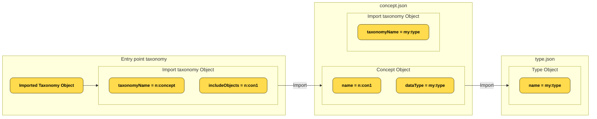
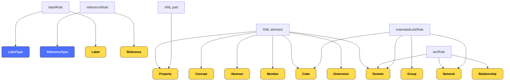
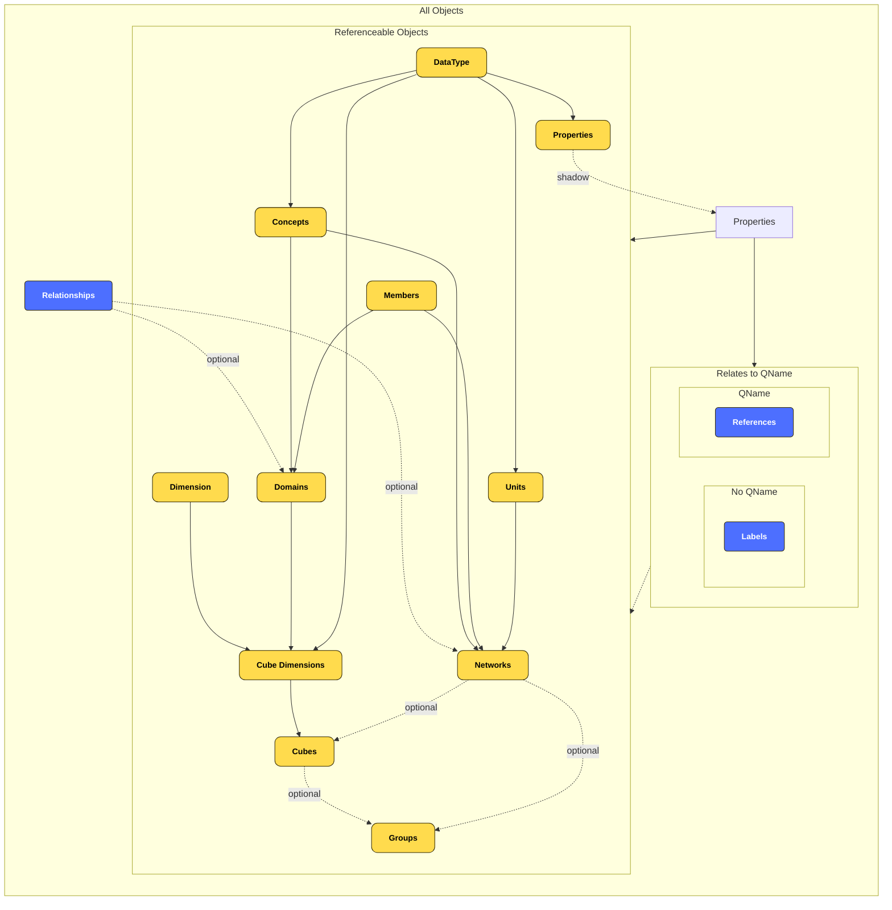
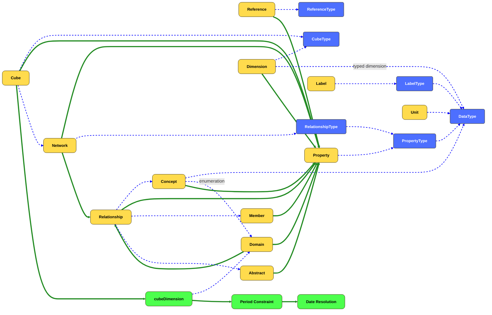

Title:       XBRL Taxonomy Model 
Version:     1.0
Type:        Specification
Status:      DRAFT
Editor:      Herm Fischer, Exbee Ltd <herm@exbee.dev>
             Campbell Pryde, XBRL.US <campbell.pryde@xbrl.us>
             Paul Warren, XBRL International Inc. <pdw@xbrl.org>
Contributor: David Bell, UBPartner SAS <dbell@ubpartner.com>
             Phillip Engel, XBRL.US <phillip.engel@xbrl.us>

# Introduction
The XBRL v2.1 [XBRL 2.1] and XBRL Dimensions v1.0 [DIMENSIONS] specifications define an XML-based syntax for business reporting, along with accompanying metadata definitions known as taxonomies. While XML is the original format for XBRL, there is increasing demand to work with XBRL data in alternative formats such as JSON, relational databases, and CSV.

However, this is made difficult by the lack of a clear separation between the semantic content of a taxonomy and the syntactic detail specific to the XML representation. As a result, different tools and users may interpret and represent XBRL data inconsistently, often exposing unnecessary technical detail that hinders usability.

This specification introduces a syntax-independent model for representing an XBRL taxonomy. The model captures the full range of semantic information encoded in the XML syntax of XBRL v2.1, but abstracts away from format-specific constructs. This enables consistent interpretation and use of XBRL taxonomies across multiple syntactic representations, supporting simpler, more portable implementations and greater accessibility for a broader range of users and technologies.

## Scope

This document defines a model for an XBRL taxonomy. It focuses solely on the structural components of the taxonomy and does not attempt to model the metadata contained in an XBRL report (instance document).

## Terminology

The key words MUST, MUST NOT, REQUIRED, SHALL, SHALL NOT, SHOULD, SHOULD NOT, RECOMMENDED, MAY, and OPTIONAL, in this specification, are to be interpreted as described in [IETF RFC 2119][rfc2119].

The keywords expanded name, NCName and QName are to be interpreted as described in the [XML Names][xmlnames] specification.

### Defined terms for taxonomies

<<<A |Taxonomy Model| is a collection of taxonomy modules that comprise a taxonomy. The bounds of a taxonomy model includes all <<taxonomy component objects>> that are discovered by processing all <<importTaxonomy objects>> and `extendTargetName` attributes defined in <<taxonomy modules>> comprising the taxonomy model.>>>

<<<A |Taxonomy Module| is comprised of a single <<taxonomy object>> and <<documentInfo object>> that is defined within a single file. A taxonomy module does not include the objects referenced by an <<importTaxonomy object>>. >>>

 <<<A |dependent object| is a reference to another object using a QName within a defined object.>>>

As part of <<taxonomy model>> discovery all <<dependent objects>> MUST be present in the <<taxonomy model>> for the taxonomy to be valid.

<<<A |cube| is a structural object in a taxonomy that defines a multidimensional space for facts, specifying which dimensions and members are included, and optionally constraining or excluding certain facts.  The multidimensional space defined by a cube can be empty, sparsely or densely packed with facts. A fact can exist in one or more cubes. A cube defines all dimensions (including core dimensions like period, entity, unit, and concept) to accurately identify all facts associated with the cube. A cube can contain facts with fewer dimensions than those defined by the cube. Facts with dimensions not defined in the cube are not included within the cube. Cubes can be used to identify collections of facts that are grouped together such as facts in a Statement of Operating Activity or a listing of inventory held. A cube is defined in a taxonomy using a <<cube object>>.>>>

## Documentation conventions

QNames in parenthetical red text after a "MUST" or "MUST NOT" statement prescribe standardized error codes to be used if the preceding condition is violated. "MUST" or "MUST NOT" statements that do not have a prescribed error code are not automatically enforceable, and processors are not required to detect violations.

## Namespaces and namespace prefixes

This specification makes use of QName notation to refer to XML expanded names (the combination of a namespace URI and a local name) make use of abbreviated forms for these identifiers. The prefixes used by this specification are shown in the table below. These prefixes are [reserved prefixes](https://www.xbrl.org/Specification/oim-common/REC-2021-10-13/oim-common-REC-2021-10-13.html#term-reserved-prefix).

| Prefix | Namespace URI |
| ------ | ------ |
| xbrl  | https://xbrl.org/2025 |
| xbrli  | https://xbrl.org/2025/instance |
| xbrli-2003  | https://xbrl.org/2003/instance |
| dtr-type|	http://www.xbrl.org/dtr/type/* |
| xs    | https://www.w3.org/2001/XMLSchema |
| enum2    | https://xbrl.org/2020/extensible-enumerations-2.0 |
| oimce    | https://xbrl.org/2021/oim-common/error |
| oime | http://www.xbrl.org/2021/oim/error |
| oimte | https://xbrl.org/2025/oimtaxonomy/error |

The prefix dtr-type denotes any namespace that is the namespace for a type defined in the [Data Types Registry][dtr-types].

## Object definitions

The Taxonomy specification defines a set of object types. Each object type has a set of named properties. The type of each property is specified in the format "(*Model type* / *JSON type*)".

<<<The |model type| is>>>:

* The name of another object type;
* A semantic collection type (*set* or *ordered set*); or
* An XML Schema built-in simple type, identified by its QName.

<<<The |JSON type| is one or more JSON primitive types: string, array, object, number or null>>>.

# Validation

## JSON representation constraints

The Taxonomy Model has a standard serialisation in JSON format.  Files in this format MUST conform to the constraints in this section.

JSON documents MUST be valid JSON as defined in [RFC 8259] (!!oime:invalidJSON).

To ensure interoperability, all objects in JSON documents conforming to this specification MUST have unique keys (!!oime:invalidJSON).

JSON documents MUST use UTF-8 character encoding (!!oime:invalidJSON). Although a Unicode Byte Order Mark (BOM) MAY be included, it is neither required nor recommended.

This specification defines a <<model type>> and <<JSON type>> for each object property.

Values in a JSON document MUST: (!!oime:invalidJSONStructure)

- Conform to one of the specified <<JSON type>>; and
- If the <<model type>> is an XML Schema built-in simple type then the value MUST be a valid value for that type in the canonical lexical representation for that type (!!oime:invalidJSONStructure).

Properties marked as "required" MUST be present whenever the containing object is present (!!oime:invalidJSONStructure).

## Object reference constraints {#sec-object-reference-constraints}

Objects in a taxonomy model may refer to other objects in the model using a QName value that refers to the `name` property of another object. <<<In this case, the term |references| means that the value, or values in the case of collection types, of the specified property MUST correspond to the `name` property of objects of the specified type, and the specified error code MUST be raised if no object with that name exists, or an object with the correct name exists but is of the wrong type.>>>

# XBRL Taxonomy Module

## Taxonomy structure

The taxonomy module is comprised of the following objects

`documentInfo` (documentInfo object / object)
: (required) A <<documentInfo object>>.

`taxonomy` (xbrl:taxonomyObject / object)
: (required) A taxonomy object.

## DocumentInfo

<<<The |documentInfo object| provides document-level information about the taxonomy.>>> The object has the following properties:

`documentType` (xs:anyURI / string)
: (required) The fixed value https://xbrl.org/2025/taxonomy

`namespaces` (xbrl:namespaceObject / object)
: (required) A <<namespace object>> defining the prefix and associated uri.

`documentNamespace` (xs:string / string)
: (required for taxonomy modules) A string that identifies the namespace of the of the document.

`urlMapping` (xbrl:urlMappingObject / object)

: (optional) A urlMapping object defining the namespace prefix and associated url.

### Namespace object

<<<The |namespace object| is a URI map object that provides the prefix map for QNames, SQNames and other prefixed content values.>>>

The namespace object is comprised of a prefix uri pair.

 `{prefix}` (xs:anyURI / string)
 :  (required) The name of the key is the prefix and the uri is the namespace associated with the prefix.

<div class="nonNormativeNote">

```json
 "namespaces": {
            "exp":  "http://example.com/taxonomy",
            "lei": "http://standards.iso.org/iso/17442",
            "xbrl": "https://xbrl.org/2025",
            "iso4217": "http://www.xbrl.org/2003/iso4217",
            "utr": "https://xbrl.org/2025/utr",
            "xbrli":"https://xbrl.org/2025/instance",
            "xs": "http://www.w3.org/2001/XMLSchema",
            "ref":"https://xbrl.org/2025/ref"  
            }
```

</div>

### Document type identification

A document is considered to have the xBRL-taxonomy document type if it is a valid JSON document and the JSON Pointer `/documentInfo/documentType` resolves to the string:

https://xbrl.org/2025/taxonomy

If a document does not have this document type, it MUST be processed according to the rules defined in the OIM Common specification. In such cases, the errors defined in this specification MUST NOT be raised—with the exception of !!oime:invalidJSON, which MUST still be enforced.
                
## Taxonomy object {#sec-taxonomy-object}

<<<The |taxonomy object| is the container object that includes all the component objects that comprise a taxonomy. It has a QName of xbrl:taxonomyObject.>>>

<<< |Taxonomy component objects| are the objects used to define a taxonomy. Each type of taxonomy object is identified using an object QName. The table below shows all the possible taxonomy objects that can be used to define a taxonomy, their associated QNames, and if they are referenceable.>>>

| Object Type     |Object  QName| Referenceable |Description                                                                                   |
|-----------------|-------------|---------------|-----------------------------------------------------------------------------------------------|
| Taxonomy        | xbrl:taxonomyObject| true |Defines all objects and properties of a taxonomy. (see [](#sec-taxonomy-object)) |
| ImportTaxonomy  | xbrl:importTaxonomyObject | false | Defines external taxonomy objects that can be imported into the taxonomy. (see [](#import-taxonomy-object)) |
| Concept         |  xbrl:conceptObject| true | Defines concepts within the taxonomy.  (see [](#concept-object))                              |
| Abstract        |  xbrl:abstractObject| true | Defines abstracts within the taxonomy.  (see [](#abstract-object))
| Cube            |  xbrl:cubeObject| true |Defines a multidimensional structure to organize facts. (see [](#cube-object)) |
| CubeDimension     |  xbrl:cubeDimensionObject| false | Defines dimensions within the cube object. ***(Component of a Cube)*** (see [](#cubedimension-object)) |
| PeriodConstraint |  xbrl:periodConstraintObject| false | Defines periods that can be used on the period dimension. ***(Component of a Cube)*** (see [](#period-constraints-object)) |
| DateResolution | xbrl:dateResolutionObject| false |Defines dates that are used by the period constraint object. ***(Component of a Cube)*** (see [](#date-resolution-object)) |
| Dimension       |  xbrl:dimensionObject| true |Defines dimensions within the taxonomy. (see [](#dimension-object))                    |
| Domain          |  xbrl:domainObject| true |Defines domains within the taxonomy. (see [](#domain-object))                                 |
| DomainRoot      |  xbrl:domainRootObject| true |Defines the domain root objects within the taxonomy. (see [](#domain-root-object))                                 |
| Entity          |  xbrl:entityObject| true |Defines an entity object in the taxonomy. (see [](#entity-object))                            |
| Group           |  xbrl:groupObject| true |Defines groups within the taxonomy. (see [](#group-object))                                   |
| GroupContent    |  xbrl:groupContentObject| false |Links groups within the taxonomy to taxonomy objects (see [](#groupcontent-object))           |
| Network         |  xbrl:networkObject| true |Defines networks within the taxonomy. (see [](#network-object))                               |
| Relationship    | xbrl:relationshipObject| false |Allows the assignment of relationships to another taxonomy object that contains relationships, such as adding a domain member to a domain object. It defines relationships between concepts, such as summation-item and parent-child. ***(Component of a Network and Domain)*** (see [](#relationship-object)) |
| RelationshipType |  xbrl:relationshipTypeObject| true |Used to define properties of a relationship. (see [](#relationshiptype-object))               |
| Label            |  xbrl:labelObject| false |Defines labels within the taxonomy. (see [](#label-object))                                   |
| Member          |  xbrl:memberObject| true |Defines members within the taxonomy.  (see [](#member-object))                              |
| Property        |  xbrl:propertyObject| false |Defines property values for objects in the taxonomy.    (see [](#property-object))   
| Reference       |  xbrl:referenceObject| true |Defines references within the taxonomy.    (see [](#reference-object))                        |
| DataType        |  xbrl:dataTypeObject| true |Defines datatypes within the taxonomy. (see [](#datatype-object))                            |
| PropertyType    |  xbrl:propertyTypeObject| true |Used to define properties that can be used on other taxonomy objects such as concepts and relationships. (see [](#propertytype-object))|
| LabelType       |  xbrl:labelTypeObject| true |Used to define a label type in the taxnomy. (see [](#labeltype-object))|
| ReferenceType   |  xbrl:referenceTypeObject| true |Used to define a reference type in the taxonomy. (see [](#referencetype-object))|
| CubeType        |  xbrl:cubeTypeObject| true |Used to define the allowable dimensions associated with different cube types. (see [](#cubetype-object))|           
| TableTemplate   |  xbrl:tableTemplateObject| true |Defines a two dimensional structure where facts can be allocated to for presentation purposes. (see [](#tabletemplate-object)) |
| DataTable   |  xbrl:dataTableObject| true |Defines a two dimensional structure based the structure of a cube. (see [](#datatable)) |
| Axis   |  xbrl:axisObject| false | Defines the dimensions associated with an axis and the labels and order that items appear on the axis. (see [](#axis-object)) |
| AxisDimension   |  xbrl:axisDimensionObject| false |Defines the dimensions associated with an axis in the data table object. (see [](#axis-dimension-object)) |
| Transform            |  xbrl:transformObject| true |Defines a transform object in the taxonomy. (see [](#transform-object))                                 |
| Unit            |  xbrl:unitObject| true |Defines a unit object in the taxonomy. (see [](#unit-object))                                 |
| UnitType           |  xbrl:unitTypeObject| false |Associates multiple datatypes used in a unit to a base datatype. (see [](#unitType-object))                                 |


<<<A |referenceable taxonomy object| is an object that can be identified using a QName. The table above identifies referenceable objects.>>>

### Taxonomy object properties

A <<taxonomy object>> represents an entire taxonomy. It is a container for all the components of the taxonomy.

The properties of the <<taxonomy object>> are as follows:

`name` (xs:QName / string)
: (required) The name is a QName that uniquely identifies the <<taxonomy object>>.

`frameworkName` (xs:string / string)
: (optional) The framework name of the taxonomy such as "US-GAAP" that indicates the taxonomy broad taxonomy family. The framework name stays consistent between regular taxonomy releases of the same taxonomy domain.

`version` (xs:string / string)
: (optional) Used to identify the version of the taxonomy such as the year of release.

`resolved` (xs:boolean / boolean)
: (required) Used to indicate if the taxonomy is in a resolved form. Allowable values are `true` or `false`. True indicates that the taxonomy is a complete model including all objects post <<taxonomy model>> processing that has resolved all <<importTaxonomy objects>> and `extendTargetName` attributes. False indicates that the taxonomy is pre <<taxonomy model>> processing and is not in resolved form. [[ PW: I don't understand what this is for. Surely the presence/absence of `importedTaxonomies` conveys this information? ]]

`importedTaxonomies` (ordered set / array)
: (optional) ordered set of <<importTaxonomy objects>> that can comprise QName of the taxonomy to be imported, an object type or a taxonomy object referenced by its QName.

`abstracts` (ordered set / array)
: (optional) ordered set of <<abstract objects>>.

`concepts` (ordered set / array)
: (optional) ordered set of <<concept objects>>.

`cubes` (ordered set / array)
: (optional) ordered set of <<cube objects>>.

`cubeTypes` (ordered set / array)
: (optional) ordered set of <<cubeType objects>>.

`dataTypes` (ordered set / array)
: (optional) ordered set of <<dataType objects>>.

`dimensions` (ordered set / array)
: (optional) ordered set of <<dimension objects>>.

`domains` (ordered set / array)
: (optional) ordered set of <<domain objects>>.

`domainRoots` (ordered set / array)
: (optional) ordered set of <<domain root objects>>.

`entities` (ordered set / array)
: (optional) ordered set of <<entity objects>>.

`groups` (ordered set / array)
: (optional) ordered set of <<group objects>>.

`groupContents` (ordered set / array)
: (optional) ordered set of <<groupContent objects>> that link a group QName to a list of network or cube objects.

`labels` (ordered set / array)
: (optional) ordered set of <<label objects>>.

`members` (ordered set / array)
: (optional) ordered set of <<member objects>>.

`networks` (ordered set / array)
: (optional) ordered set of <<network objects>>.

`propertyTypes` (ordered set / array)
: (optional) ordered set of <<propertyType objects>>.

`references` (ordered set / array)
: (optional) ordered set of <<reference objects>>.

`referenceTypes` (ordered set / array)
: (optional) ordered set of <<referenceType objects>>.

`relationshipTypes` (ordered set / array)
: (optional) ordered set of <<relationshipType objects>>.

`tableTemplates` (ordered set / array)
: (optional) ordered set of tableTemplate objects.

`dataTables` (ordered set / array)
: (optional) ordered set of dataTable objects.

`units` (ordered set / array)
: (optional) ordered set of <<unit objects>>.

`properties` (ordered set / array)
: (optional) ordered set of <<property objects>> used to specify additional properties associated with the taxonomy.

`transforms` (ordered set / array)
: (optional) an ordered set of transform objects.

## Import taxonomy object {#import-taxonomy-object}

<<<The |importTaxonomy object| defines the <<taxonomy modules>> and taxonomy objects that are included in the <<taxonomy model>>. The ImportTaxonomy object is the only mechanism for importing components to create a  <<taxonomy model>>. Only valid XBRL taxonomies may be imported into another taxonomy. The importTaxonomy object allows for the importation of taxonomy files, sets of objects within taxonomies, or sets of objects grouped by their object type within taxonomies.>>>

### Import taxonomy properties

The <<importTaxonomy object>> has the following properties:

`taxonomyName` (xs:QName / string)
: (required) The QName of the taxonomy to import. When importing XBRL 2.1 taxonomies, the QName comprising the namespace of the taxonomy to import and a local name of taxonomy is defined (e.g., `ifrs:Taxonomy`).

`includeObjects`  (set / array)
: (optional) A set of object QNames that should be imported from the `taxonomyName` location property. Only the objects defined in the includeObjects set and any <<dependent objects>> will be added to the <<taxonomy model>>. The dependents of each object are defined in this specification.

`includeObjectTypes` (set / array)
: (optional) A set of  object type QNames that should be  imported from the `taxonomyName` location property.  Examples include `xbrl:conceptObject` and `xbrl:memberObject`. All objects of the specified object types from the `taxonomyName` and any <<dependent objects>> will be imported. This property can only reference taxonomy object types. The `includeObjectTypes` cannot include the <<label object>>.

`excludeLabels` (xs:boolean / boolean)
: (optional) If set to `true`, any labels attached to the objects comprising the <<taxonomy model>> deriving from the `taxonomyName` property will be excluded from the <<taxonomy model>>. The default value is `false`.

`followImport` (xs:boolean / boolean)
: (optional) If set to `false`, the <<taxonomy model>> resolution will not import taxonomies defined in descendant `ImportTaxonomy` Objects. These imports will be excluded from the <<taxonomy model>>. The default value is `true`. This means if a taxonomy QName is provided, all importTaxonomy objects will be brought into the <<taxonomy model>>. [[PW: why do we need this? ]]

[[ PW: are taxonomy modules required to import all dependencies, or is it sufficient that all dependencies are in scope that you attempt to create a complete taxonomy model ?]]

[[ CJP: TO UPDATE : Taxonomy modules have to be individually valid.  If A call b and c b is unaware of c object.]]

[[DMS: what happens in the case that we have recursive importing of taxonomies? ]]

<<Import Taxonomy Logic>>

### Taxonomy Model discovery

The `importTaxonomy` object defines additional taxonomy objects to include in the <<taxonomy model>>. When the `includeObjects` or `includeObjectTypes` properties are not used, all the objects of the taxonomy identified by the `taxonomyName` property location are included in the <<taxonomy model>>. If the taxonomy identified by `taxonomyName` property location contains `importTaxonomy` objects, the taxonomy objects in these <<taxonomy modules>> are included in the <<taxonomy model>>. This identifies a "chain" of documents containing taxonomy objects that are included in the <<taxonomy model>>.

When the `includeObjects` or `includeObjectTypes` properties are present, the `importTaxonomy` object of the <<taxonomy module>> found at the `taxonomyName` property are not processed and the taxonomy objects referenced by the `importTaxonomy` object are not included in the <<taxonomy model>>. 

When an object identified by the `includeObjects` or `includeObjectTypes` property has dependencies, these <<dependent objects>> are included in the <<taxonomy model>>. These <<dependent objects>> may be in the same document or found by following the chain of `importTaxonomy`. The other taxonomy objects in these documents discovered through <<dependent objects>> are not included in the <<taxonomy model>>.

<div class="nonNormativeNote" markdown="1">

The diagram below describes the taxonomy importing the object `n:con1` from the taxonomy `n:concepts` taxonomy name. The object `n:con1` has a datatype of `my:type` that is not included in the taxonomy `n:concepts`. The `n:concepts` taxonomy object resolves to the physical file `concept.json` which is used to import `my:types` taxonomy to locate the object `my:type` in the file location `type.json`.  If `my:type` cannot be found then an error is returned.



</div>

Label objects of any defined object are always included if they are in the taxonomy names that are are defined as an object in the set of `includeObjectTypes`. Label objects cannot be imported using the `includeObjectTypes` property, as the `relatedName` QNames defined in the <<label object>> may not be in the <<taxonomy model>>.

Labels can be excluded from the objects in the <<taxonomy model>> if the `excludeLabels` property is set to `true`.

There is no constraint prohibiting a taxonomy importing a taxonomy that creates a cycle of imports. If part of <<taxonomy model>> discovery a taxonomy module  imports a taxonomy module that has already been imported the import statement should be ignored if its properties are the same. If it has different `includeObjects` then the additional include objects are included in the final <<taxonomy model>>.

### Import taxonomy constraints

The QNames defined in the `includeObjects` property MUST be defined in the file identified using the `taxonomyName` property (!!oimte:unknownIncludedObject).

The `includeObjectTypes` property MUST contain the QNames corresponding to <<taxonomy component objects>>, as definedin in [](#sec-taxonomy-object) but MUST NOT include `xbrl:labelObject` (!!oimte:invalidIncludedObjectType).


## Concept object {#concept-object}

<<<A |concept object| defines objects that can appear on the <<oim:concept core dimension>>. Non-abstract concept objects can have both numeric and non-numeric fact values [[PW: do we need to say this?]]. All concepts can have associated fact values [[PW: No, non-abstract concepts can be used in a report to report a fact value. Not sure if this needs saying here]].  A concept object is not required to have a fact value associated with it in report [[PW: this is confusing, as it might suggest that a concept can have at most one value]] . The properties of the concept object determine the type of fact values that can be associated with the concept.>>>

The <<concept object>> in the model includes its explicit properties defined below.  Concepts are also related to label and reference objects that reference the concept's QName. Specialised relationships, such as traits, are resolved as a concept properties.

### Concept properties

The <<concept object>> has the following explicit properties:

`name` (xs:QName / string)
: (required) The name is a QName that uniquely identifies the <<concept object>>.

`dataType` (xs:QName / string)
: (required) Indicates the datatype of the concept. These are provided as a QName based on the datatypes specified as xml schema datatypes, datatypes defined in this specification or custom datatypes defined in a taxonomy. [[PW need standard text for this]]

`periodType` (xbrli:periodType / string)
: (required) Indicates the period type of the concept. The value can be either `instant`, `duration` or `none` . If the concept has an a atemporal value (i.e. the value does not change with the passage of time) it must be defined with a value of `none`. This allows facts to be reported without the "period" dimension.

`enumerationDomain` (xs:QName / string)
: (optional) Used to specify enumerated domain members that are associated with a <<domain object>> defined in the taxonomy.

`nillable` (xs:boolean / boolean)
: (optional) Used to specify if the concept can have a nill value. The default value is false.

`properties` (ordered set / array)
: (optional) ordered set of <<property objects>> used to specify additional properties associated with the concept using the <<property object>>. 

### Dependencies

* The `dataType` property <<references>> a <<dataType object>> (!!oimte::unknownDataType).
* The `enumerationDomain` property <<references>> a <<domain object>> (!!oimte::unknownDomain).
* The `properties` property <<references>> <<property objects>> (!!oimte::unknownDomain).

### Concept object constraints

The `periodType` property MUST have a value of either `instant`, `duration` or `none` (!!oimte:invalidPeriodType).

## Abstract object {#abstract-object}
<<<An |abstract object| defines objects that have no reportable value, but are components of the concept dimension.  Abstract objects are used to define headers and to organize concepts into hierarchies on the <<oim:concept core dimension>>.>>>

### Abstract object properties
The <<abstract object>> has the following explicit properties:

`name` (xs:QName / string)
: (required) The name is a QName that uniquely identifies the <<abstract object>>.

`properties` (ordered set / array)
: (optional) an ordered set of <<property objects>> used to specify additional properties associated with the <<abstract object>> using the  <<property object>>. 

### Abstract object constraints

An <<abstract object>> QName MUST NOT be used as a source or target in a domain object relationship of a taxonomy defined dimension. !!oimte:invalidDimensionMember

An <<abstract object>> QName MUST NOT be used as a source or target in a domain object relationship of a <<oim:entity core dimension>>. !!oimte:invalidDimensionMember

An <<abstract object>> QName MUST NOT be used as a source or target in a domain object relationship of a <<oim:unit core dimension>>. !!oimte:invalidDimensionMember

An <<abstract object>> MUST NOT be defined as a dimension member on a fact. !!oimte:invalidDimensionMember

## Member object {#member-object}
<<<A |member object| defines objects that can appear on a taxonomy defined dimension. Members do not define the datatype of the fact values associated with the object.>>>

### Member object properties
The <<member object>> has the following explicit properties:

`name` (xs:QName / string)
: (required) The name is a QName that uniquely identifies the <<member object>>.

`properties` (ordered set / array)
: (optional) an ordered set of <<property objects>> used to specify additional properties associated with the <<member object>> using the  <<property object>>.

### Member object constraints

A <<member object>> QName MUST NOT be used as a source or target in a domain object relationship of a <<oim:concept core dimension>>. !!oimte:invalidDimensionMember

A <<member object>> QName MUST NOT be used as a source or target in a domain object relationship of a <<oim:unit core dimension>>. !!oimte:invalidDimensionMember

A <<member object>> QName MUST NOT be used as a source or target in a domain object relationship of a <<oim:entity core dimension>>. !!oimte:invalidDimensionMember

A <<member object>> QName MUST NOT be used as a source or target in a domain object relationship of a language core dimension. !!oimte:invalidDimensionMember

## Dimension object {#dimension-object}

<<<The |dimension object| defines a taxonomy-defined dimension.>>> Taxonomy-defined dimensions can be either "typed" or "explicit". Allowed values for a typed dimension are constrained by the datatype specified in the `domainDataType` property. Allowed values for an explicit dimensions are QNames taken from the set of QNames identified by the `domainRoot` property.

### Properties of the dimension object

`name` (xs:QName / string)
: (required) The QName of the dimension object.

`domainDataType` (xs:QName / string)
: (required for typed dimension) The QName of the datatype for a typed dimension.

`domainRoot` (xs:QName / string)
: (required for explicit dimension) The QName of of the <<domain root object>> for the dimension.

`cubeTypes` (ordered set / array)
: (optional) an ordered set of QNames that indicate the cube type the dimension can only apply to. Must be a QName value defined by built in cube types or taxonomy defined cube types. For example `xbrl:eventCube`, `xbrl:referenceCube` etc. If not defined the dimension can be applied to any cube type.

`properties` (ordered set / array)
: (optional) an ordered set of <<property objects>> used to specify additional properties associated with the dimension using the  <<property object>>.

### Dimension object dependencies

The <<dimension object>> is dependent on the following associated objects being present in the <<taxonomy model>>:

- <<dataType object>> if the <<dimension object>> is typed.
- <<cubeType object>> if not a built in cube type.
- <<property object>> defined if the `properties` property is used.

### Dimension object constraints

The `cubeType` property MUST contain a QName of a <<cubeType object>>. !!oimte:invalidPropertyValue

The `domainDataType` property MUST contain a QName of  a <<dataType object>>. !!oimte:invalidPropertyValue

The `domainRoot` property MUST contain a QName of a <<domain root object>>. !!oimte:invalidPropertyValue

The <<dimension object>> MUST include either a `domainDataType` property or a `domainRoot` property, but not both !!oimte:invalidDomainType

## Domain object {#domain-object}

<<<The |domain object| defines a hierarchical domain of domain root, concept, or member objects. The domain object defines both primary concept domains and taxonomy defined dimension domains. Domains can also be defined to be used as an enumeration domain of concepts and the domains of a trait concept. A domain is comprised of relationships that determine the structure of the domain. A domain object cannot be used as a member of a fact.>>>

The relationships in a <<domain object>> always have a relationship type of domain-member. This relationship type (domain-member) never has to be defined as it can only occur in the <<domain object>>.

Domains must include the QName of a <<domain root object>> for the `root` property . Multiple domains can be defined with the same domain root object. The definition of dimensions includes the <<domain root object>> that can be used with the dimension. This allows the identification of related dimensional domains. 

The <<domain root object>> has to be the root object of the <<relationship object>> defined within the <<domain object>>


### Importing domain objects

Importing taxonomies cannot remove a domain from an imported taxonomy or remove the concepts in the domain. Concepts may be imported and reassembled in a domain defined in an importing taxonomy.

<<Domain objects>> can have member or concept objects added by an importing taxonomy. Importing taxonomies can add relationships to an existing <<domain object>> by referencing the name of the domain by using the `extendTargetName` property to add the relationships defined to the target domain.

New domain objects can be added in an importing taxonomy.

When expanding a domain using the `extendTargetName` property the `root` attribute should not be defined.

### Domain object properties

The properties of the <<domain object>> are:

`name` (xs:QName / string)
: (required if no `extendTargetName`) [[PW: this is inconsistent with how we capture this type of constraint elsewhere]] The  QName that uniquely identifies the domain object. The QName is used to reference the domain from extensible enumeration concepts and dimensions that use the domain.

`root` (xs:QName / string)
: (required if no `extendTargetName`) The QName that uniquely identifies the root of the domain object. This must be a <<domain root object>>.

`relationships` (ordered set / array)
: (optional) This is an ordered set of <<relationship objects>> that associate concepts with the domain. A list of relationships can be organised into a domain hierarchy. [[PW: What is the significance of the ordering?]]

`extendTargetName` (xs:QName / string)
: (required if no `name`) Names the <<domain object>> that the defined domain relationships should be appended to. The items in the domain with this property are appended to the end of the relationships defined in the target <<domain object>>. This property cannot be used in conjunction with the `name` property.

`properties` (ordered set / array)
: (optional) an ordered set of <<property objects>> used to specify additional properties associated with the domain using the  <<property object>>. 

### Domain object dependencies

* The `root` property references a <<domain root object>> (!!oimte:unknownDomainRoot)
* The `extendTargetName` references a <<domain object>> (!!oimte::unknownDomain)
* The `properties` property <<references>> <<property objects>> (!!oimte::unknownDomain).

### Domain object constraints

The <<relationship object>> in the <<domain object>> MUST NOT include a `relationshipType` property (!!oimte:invalidObjectProperty). [[PW Which object? There's a set of them.]]

A <<domain root object>> QName MUST NOT be defined as a `target` in the domain <<relationship object>>. !!oimte:invalidDomainRoot [[PW: Which relationship object?]]

The `name` and `extendTargetName` properties MUST NOT both appear in a <<domain object>> (!!oimte:invalidObjectProperty).

A <<domain object>> MUST not be used as a dimension member of a fact. !!oimte:invalidFactMember [[PW: This sounds like a report constraint rather than a taxonomy constraint.  Also, I think we should capture this as a positive statement about what is allowed to be a member (member objects, presumably).]] 

## Domain root object {#domain-root-object}

<<<The |domain root object| defines the root of a domain object. The domain root object identifies domains that can be used with a specific dimension. Multiple domains can be associated with a dimension in different cubes, but each of those domains must have the same domain root object. >>>

Every domain object must include a <<domain root object>>. [[PW: this seems misplaced. It seems like a constraint on domain objects, although we have an issue with the lack of separation between syntactic domain objects (which don't have to have a root property, because they might have extendTargetName instead, and the semantic objects which must have a root.]].

Multiple domains can be defined with the same domain root object. The definition of dimensions includes the domain root object that can be used with the dimension. This allows the identification of related dimensional domains.

The built in concept dimension `xbrl:concept` has a built in domain root object of `xbrl:conceptDomain`.

The built in entity dimension `xbrl:entity` has a built in domain root object of `xbrl:entityDomain`.

The built in unit dimension `xbrl:unit` has a built in domain root object of `xbrl:unitDomain`.

### Domain root object properties

The properties of the <<domain root object>> are:

`name` (xs:QName / string)
: (required) The  QName that uniquely identifies the domain root object.

`properties` (ordered set / array)
: (optional) an ordered set of <<property objects>> used to specify additional properties associated with the <<domain root object>> using the  <<property object>>. 

### Domain root object constraints

A <<domain root object>> QName MUST NOT be a target in a relationship domain object relationship. !!oimte:invalidDomainMember [[PW: probably better to describe the constraints on relationships in domain objects in the domain objects section ]]

A domain root object MUST not be used as a dimension member of a fact. !!oimte:invalidFactMember

## Cube object {#cube-object}

<<<A |cube object| identifies facts that are contained within the cube space. This enables a collection of facts to be referenced by referring to a specific cube. The facts associated with a cube are determined by the dimensions and members of the cube and the dimensions and members associated with the fact.>>>

A cube defines all dimensions (e.g. incl period, entity, units ) to accurately identify all facts associated with the cube. 

<div class="nonNormativeNote">
A balance sheet cube representing facts for a holding company if defined correctly should exclude facts associated with a subsidiary by constraining the entity dimension. The same is true for the periods and unit dimensions. The ability to define the core dimensions in the definition of a cube allows for the accurate description of facts in the cube.
</div>

A <<cube>> has an optional cubeType property that identifies the type of <<cube>> being represented. This must match a defined <<cubeType object>> or specification defined cube object. Depending on the `cubeType` core dimensions may or may not be included. A report cube will always include the period, primary, entity and unit dimensions, whereas an event cube will only include the <<oim:concept core dimension>>. 

A <<cube>> contains all facts that match the taxonomy defined dimensions and member objects, the <<oim:concept core dimension>> and concept objects, the <<oim:unit core dimension>> and unit objects, <<oim:entity core dimension>> and <<entity objects>> and period core dimension with matching typed values.

<<<A cube can contain facts that have less dimensions than those defined in the cube. A fact can appear in the cube without one or more dimensions as long as each of the <<cubeDimension object>>s has the property `allowDomainFacts` set to `true` for the dimensions missing from the fact. Valid facts in a cube without all the dimensions defined in the cube are called an |optional dimension value|.>>>

A fact cannot appear in a <<cube>> if the fact has a dimension that is not defined as part of the <<cube>>.

<<<An |exclude cube| removes facts from the defined cube. An exclude cube is a <<cube object>> defined in the taxonomy.  The intersection of facts in the exclude <<cube>> and the defined <<cube>> are removed from the resulting cube. The intersection can be all facts or no facts.>>>

The <<exclude cube>> is defined using the `excludeCubes` property. There can be zero to many exclude cubes defined in a <<cube object>> definition.  With multiple exclude cubes, the intersection of the aggregate facts from the <<exclude cubes>> and the defined cube are removed from the resulting cube.

### Cube properties

The <<cube object>> has the following properties:

`name` (xs:QName / string)
: (required) The name property is a QName that uniquely identifies the <<cube object>>.

`cubeType` (xs:QName / string)
: (optional) The cubeType property identifies the type of cube being defined. This must match a defined <<cubeType object>> or specification defined cube object. The specification defined cube types are `xbrl:eventCube`, `xbrl:positionCube`, `xbrl:referenceCube`, `xbrl:reportCube`, `xbrl:journalCube`, `xbrl:eventDetailsCube`, `xbrl:timeSeriesCube` and `xbrl:defaultCube`. If no QName is provided the default is `xbrl:reportCube`.

`cubeDimensions` (ordered set / array)
: (required) An ordered set of <<cubeDimension objects>> that identify the dimensions and associated domains used on the cube.

`cubeNetworks` (ordered set / array)
: (optional) An ordered set of <<network object>> QNames that reference network objects that are directly related to the cube.

`excludeCubes` (ordered set / array)
: (optional) An ordered set of <<cube object>> QNames that remove the facts of the exclude cube from the facts of the defined cube.

`cubeComplete` (xs:boolean / boolean)
: (optional) A boolean flag that indicates if all cells in the cube are required to have a value. If `true` then all cube cells must include a fact value. If a value is not provided for the `cubeComplete` property then the default is `false`.

`properties` (ordered set / array)
: (optional) An  ordered set of <<property objects>> Used to specify additional properties associated with the cube using the  <<property object>>. 

### Cube object dependencies

The <<cube object>> is dependent on the following associated objects being present in the <<taxonomy model>>:

- <<network objects>> defined if the `cubeNetworks` property is used.
- <<cubeType object>> if not a built in cube type.
- <<cube object>> defined if the `excludeCube` property is defined.
- <<property object>> defined if the `properties` property is used.
  
### Cube constraints

The `cubeType` property MUST be a QName of a <<cubeType object>>. !!oimte:invalidPropertyValue

The `cubeDimensions` property MUST NOT include more than one <<cubeDimension object>> with the same `dimensionName` property. !!oimte:duplicateObjects

The defined cube MUST NOT be defined in the set of `excludeCubes` within the same <<cube object>>. !!oimte:invalidPropertyValue

The `cubeNetworks` property MUST only reference the QNames of <<network objects>>. !!oimte:invalidCubeNetwork

The `cubeNetworks` property MUST reference  <<network objects>> that exists in the <<taxonomy model>>. !!oimte:missingQNameReference

The `excludeCubes` property MUST reference  <<cube objects>> that exists in the <<taxonomy model>>. !!oimte:missingQNameReference

The processor MUST report an error if the `cubeComplete` property is set to `true` and a cube space in the cube does not have a value. !!oimte:factMissingFromCube

## Cube dimension object {#cubedimension-object}

<<<The |cubeDimension object| is used to associate a dimension with a specific <<cube object>>. Each <<cube object>> must contain at least one or more cube dimension objects. Specific cube types defined by the `cubeType` property restrict what dimension objects can appear in the cube. The cubeDimension object defines the QName of the <<domain object>> associated with the dimension. The cubeDimension object defines if concept fact values in the cube without a dimensional qualifier (<<optional dimension value>>) are included in the cube.  The cubeDimension object defines properties that constrain the fact values used on the period dimensions.>>>

The facts contained in a cube are those facts that match the dimensions and members defined in the cube object. The fact values must match the members of the cube dimension.

Where a taxonomy defined dimension is defined with NO `domainName` property then a fact with any member and the dimensions defined by the cube will appear in the cube.

Where a concept dimension is defined with NO `domainName` property then a fact with any concept will appear in the cube.

Where a unit dimension is defined with NO `domainName` property then a fact with any unit will appear in the cube.

Where an entity dimension is defined with NO `domainName` property then a fact with any entity will appear in the cube.

### Cube dimension object properties

The <<cubeDimension object>> has the following properties:

`dimensionName` (xs:QName / string)
: (required) The QName of the <<dimension object>> that is used to identify the dimension. For the core dimensions of concept, period, entity and unit, the core dimension QNames of xbrl:concept, xbrl:period, xbrl:entity, xbrl:unit and xbrl:language are used. The <<dimension object>> indicates if the dimension is typed or explicit.

`domainName` (xs:QName / string)
: (optional) The QName of the <<domain object>> that is used to identify the domain associated with the dimension. Only one domain can be associated with a dimension. The domain name cannot be provided for a typed dimension or the  <<oim:period core dimension>>.

`typedSort` (xs:string / string)
: (optional if typed dimension) A string value that indicates the sort order of the typed dimension.  The values can be either `asc` or `desc`.  The values are case insensitive.  This indicates the viewing order of the values using a typed dimension. The `typedSort`  property cannot be used with an explicit dimension. The `typedSort` can be used with the period dimension. The sort order is applied to each period constraint defined in  `periodConstraints`. If there are two period constraints the first for instant and the second for duration and  a `typedSort` of `asc` then all instant dates appear first ascending, then all duration dates appear second in ascending order.

`allowDomainFacts` (xs:boolean / boolean)
: (optional) A boolean value that indicates if facts not identified with the dimension are included in the cube. These facts are called <<optional dimension values>>. For typed and explicit dimensions the value defaults to `false`. A value of `true` for a typed or explicit dimension will include facts that don't use the dimension in the cube. For the  <<oim:period core dimension>>, forever facts or facts with no period dimension are included when this value is set to `true`. For units, this is a unit with no units such as a string or date. For the  <<oim:entity core dimension>>, it is fact values with no entity. This property cannot be used on the <<oim:concept core dimension>>.

`periodConstraints` (ordered set / array)
: (optional only for <<oim:period core dimension>>) Defines an ordered set of <<periodConstraint objects>> to restrict fact values in a cube to fact values with a specified period.

### Cube dimension object dependencies

The <<cubeDimension object>> is dependent on the following associated objects being present in the <<taxonomy model>>:

- <<dimension object>> defined in the  `dimensionName` property.
- <<domain object>> defined in the  `domainName` property.

### Cube dimension object constraints

The `periodConstraints` property MUST only be used where the `dimensionName` property has a QName value of xbrl:period.  !!oimte:invalidDimensionConstraint

A `dimensionName` with a QName of xbrl:concept MUST be defined in a <<cube object>>. !!oimte:missingConceptDimension

If the `dimensionName` property has a QName of xbrl:concept then all objects as a `source` in the relationships of the `domainName` object MUST be a <<concept object>> an <<abstract object>> or `xbrl:conceptDomain`. !!oimte:invalidRelationshipSource

If the `dimensionName` property has a QName of xbrl:concept then all objects as a `target` in the relationships of the `domainName` object MUST be a <<concept object>> or an <<abstract object>>. !!oimte:invalidRelationshipTarget

If the `dimensionName` property has a QName of `xbrl:entity` then all objects as a `source` in the relationships of the `domainName` object MUST be an <<entity object>> or `xbrl:entityDomain`. !!oimte:invalidRelationshipSource

If the `dimensionName` property has a QName of xbrl:entity then all objects as a `target` in the relationships of the `domainName` object MUST be <<entity objects>>. !!oimte:invalidRelationshipTarget

If the `dimensionName` property has a QName of `xbrl:unit` then all objects as a `source` in the relationships of the `domainName` object MUST be a <<unit object>> or `xbrl:unitDomain`. !!oimte:invalidRelationshipSource

If the `dimensionName` property has a QName of` xbrl:unit` then all objects as a `target` in the relationships of the `domainName` object MUST be  a <<unit object>. !!oimte:invalidRelationshipTarget

If the `dimensionName` property has a QName of an explicit taxonomy defined dimension then all objects as a `source`  in the relationships of the `domainName` object MUST be a <<member object>> or a <<domain root object>>.  !!oimte:invalidRelationshipSource

If the `dimensionName` property has a QName of an explicit taxonomy defined dimension then all objects as a `target` in the relationships of the `domainName` object MUST be <<member objects>>. !!oimte:invalidRelationshipTarget

If the `dimensionName` property has a QName of a typed taxonomy defined dimension then a QName MUST NOT be provided for the `domainName` property.  !!oimte:invalidQNameReference

The `domainName` property MUST NOT be used when the dimensionName property is the xbrl:period or xbrl:language dimension. !!oimte:invalidCubeDimensionProperty

The `cubeDimension` object MUST only be defined in a cube object. !!oimte:invalidCubeDimensionProperty

Any <<unit object>> defined in the unit domain property MUST have at least one associated <<concept object>> on the <<oim:concept core dimension>> with the same datatype as the <<unit object>>. !!oimte:invalidDataTypeObject

## Period constraint object {#period-constraints-object}

<<<The |periodConstraint object| defines the period constraints that are applied to the core period dimension. These constraints limit the facts associated with the cube to those periods that match the periods defined in the periodConstraint object.>>>

### Period constraint object properties

The <<periodConstraint object>> has the following properties:

`periodType` (xbrli:periodType / string)
: (required) Used to indicate if the period is an `instant` a `duration` or `none`.

`timeSpan` (xs:duration / string)
: (optional) Defines a duration of time using the XML duration type to define a duration of time. The duration of the time span maps to facts with the same duration.

`periodFormat` (period format / string)
: (optional) Defines a a duration of time with an end date. The period value defined in the taxonomy must resolve to a valid period format as defined in [xbrl-csv] specification.

`monthDay`(xbrl:dateResolutionObject / object)
: (optional) Represents a Gregorian date that recurs such as `04-16`.  The date resolution object when used with this property returns the date without the year.  The `conceptName` property of the dateResolution object can also use a datatype of monthDay.

`endDate` (xbrl:dateResolutionObject / object)
: (optional) Defines an end date for a duration fact and the date of an instant fact. Values can be provided as a literal date value, a fact with a date value, or the date context value of a date. A suffix of @start or @end may be added to any of the date formats, specifying the instant at the start or end end of the duration, respectively.

`startDate` (xbrl:dateResolutionObject / object)
: (optional) Defines a start date for a duration fact and the date of an instant fact. Values can be provided as a literal date value, a fact with a date value, or the date context value of a date. A suffix of @start or @end may be added to any of the date formats, specifying the instant at the start or end end of the duration, respectively.

`onOrAfter` (xbrl:dateResolutionObject / object)
: (optional) Defines a  date where all instant facts on or after the date are included in the cube. Duration facts which end at or after the specified datetime are included in the cube.

`onOrBefore` (xbrl:dateResolutionObject / object)
: (optional) Defines a  date where all instant facts before or on the date are included in the cube. Duration facts which end at or before the specified datetime are included in the cube

### Period constraint object constraints

The `timeSpan` property MUST NOT be used with both the `endDate` and `startDate` properties.

The `periodFormat` property MUST NOT be used with the `timeSpan`, `endDate` or `startDate` properties.

The  `periodFormat` property MUST only be used with the `periodType` property with a string value of `instant` when the suffix of @start or @end is added to any of the abbreviated formats.

If the `periodType` property is `instant` then the `timeSpan` and `startDate` properties MUST NOT be defined.

If the the `end` or `start` property is a date it MUST be a valid <<oimc:period string representation#term-period-string-representation>>. The error code !!oimte:invalidPeriodRepresentation must be raised for invalid period values.

All period constraints in the object are considered to be an AND.

Separate period constraint objects are defined as OR.

## Date resolution object {#date-resolution-object}

<<<The `endDate`, `startDate`, `onOrAfter` and `onOrBefore` property are defined using the |dateResolution object| that resolves the properties of the object to a specific date or set of dates. The date can be dependent on the fact values in an XBRL report, the context date values in a XBRL report, a literal date value or a date derived using a time shift based on one of the previous dates .>>>

### Date resolution properties

The <<dateResolution object>> has the following properties:

`conceptName` (xs:QName / string)
: (required if no `context` or `value` property) Identifies the QName of a <<concept object>> that has a date fact value.  The values of the <<concept object>> resolves to a set of dates. If no value exists in the report then the property is ignored, and no date constraint is enforced on the cube.

`context` (xs:string / string)
: (required if no `conceptName` or `value` property) Identifies the QName of a <<concept object>>. Facts in a report with this concept QName resolve to a set of dates or durations associated with the fact. The context string indicates if the end date or start date of the facts period dimension values (context) is used as the date resolution object value.   The `@` symbol following the QName is used to identify if the end date or start date of the context or contexts is used.  The context end or start dates of the fact values can resolve to a single date or a set of dates. If no value exists in the report then the property is ignored. The `context` suffix following the QName must be either `@end` or `@start`. If an `@` value is not provided then the suffix defaults to `@end`. For a fact that is an instant the `@start` and `@end` suffix will return the same value. If the fact has no period dimension then the property is ignored.

`value` (xs:date / string)
: (required if no `conceptName` or `context` property) A literal date value representing the end date.

`timeShift` (xs:duration / string)
: (optional) Defines a time duration shift from the date derived from either the `value`, `context` or `conceptName` properties.  The duration of the time shift is defined using the XML duration type to define a duration of time. A negative operator is used to deduct the timeShift from the resolved date. If the `context` or `conceptName` resolves to a set of dates the time shift is applied to all dates in the set. 

### Date resolution object dependencies

* The `conceptName` property <<references>> a <<concept object>>.
* The `context` property <<references>> a <<concept object>>.

### Date resolution constraints

The datatype of the <<concept object>> referenced by the `conceptName` property MUST be `xs:date` or derived from `xs:date`.  [[ CJP - Updated to also be derived from xs:date. PW I assume that xs:date is what we mean? Is derived from xs:date sufficient? ]]

If a suffix with @ is used on a QName value for the `context` property then the suffix value MUST be either @end or @start. [[ PW we've already said this ]]

Only one of the properties `conceptName`, `context` or `value` MUST be be present. [[ CJP Only one of these can be used and one is required. PW what does this actually mean? Does it mean that only one of these properties may be present? ]]

The `timeShift` property MUST only be used with either `value`, `context` or `conceptName`.

### Date resolution behavior

If a date is resolved using a concept name the value of all unique fact date values are returned. If there is more than one date then each unique date fact MUST create iterations of allowable date constraints on the cube.

If the `conceptName` property is used in conjunction with the `timeShift` property and multiple unique date facts are present then the value of the timeShift is applied to each fact to return a set of dates.

If the `context` property is used in conjunction with the `timeShift` property and multiple unique date contexts are present then the value of the timeShift is applied to each context to return a set of dates.

## Entity object {#entity-object}

<<<The |entity object| is used to define entities in the taxonomy that represent a legal or reporting entity. Entities are defined using an SQName that includes the scheme and the identifier. >>>

Entity objects can be used to restrict the fact values of a cube or to indicate relationships between entities in a network object.

The entity or entities reported in an OIM report do not have to be included in the taxonomy.

To include facts with entities not defined in the taxonomy in a cube the `xbrl:entity` <<cubeDimension object>> must not have a `domainName` property defined.

Entities defined in an OIM report with the same SQName as entities defined in the taxonomy, are considered to be the same entity. 

Entities are defined as an entity object. Entities cannot be defined as members.

### Entity object properties

The <<entity object>> has the following properties:

`name` (xbrli:SQName / string)
: (required) The SQName that identifies the entity.

`properties` (ordered set / array)
: (optional) an ordered set of <<property objects>> used to specify additional properties associated with the entity using the  <<property object>>. 

### Entity object constraints

The entity object MUST not be included in domains on any dimension other than the entity dimension. !!oimte:invalidDimensionMember

An <<entity object>> MUST have a SQName. !!oimte:missingSQNameProperty

## Unit object {#unit-object}

<<<The |unit object| is used to define units in the taxonomy that represent a unit of measure. Unit objects can be defined on the unit dimension. >>>

The unit defined in the taxonomy is the same unit reported in an OIM report. Information about the unit such as the description, the label, the symbol and the measurement standard is defined using labels or resources.

### Unit object properties

The <<unit object>> has the following properties:

`name` (xbrli:SQName / string)
: (required) The unitQName that identifies the unit so it can be referenced by other objects.

`dataType` (xs:QName / string)
: (required) Indicates the `dataType` of the unit. These are provided as a QName based on the datatypes specified in the XBRL 2.1 specification and any custom datatype defined in the taxonomy.

`dataTypeNumerator` (xs:QName / string)
: (optional) Indicates the `dataType` of the unit numerator when the unit is comprised of a division of two datatypes. This is an optional property and must be used with `dataTypeDenominator`

`dataTypeDenominator` (xs:QName / string)
: (optional) Indicates the `dataType` of the unit denominator when the unit is comprised of a division of two datatypes. This is an optional property and must be used with `dataTypeNumerator`

### Unit object dependencies

* The `dataType` property <<references>> a <<dataType object>> (!!oimte::unknownDataType).
* The `dataTypeNumerator` property <<references>> a <<dataType object>> (!!oimte::unknownDataType).
* The `dataTypeDenominator` property <<references>> a <<dataType object>> (!!oimte::unknownDataType).

### Unit object constraints

The <<unit object>> MUST NOT be included in a domain object.

The <<unit object>> `dataTypeNumerator` QName MUST not be the same as the <<unit object>> `dataType` QName.  !!oimte:invalidUnitDataType

The <<unit object>> `dataTypeDenominator` QName MUST not be the same as the <<unit object>> `dataType` QName.  !!oimte:invalidUnitDataType

The <<unit object>> `dataTypeDenominator` QName MUST not be the same as the <<unit object>> `dataTypeNumerator` QName.  !!oimte:invalidUnitDataType

The <<unit object>> `dataTypeNumerator` QName and <<unit object>> `dataTypeDenominator` QName MUST be dataType objects !!oimte:invalidDataTypeObject

The datatype of the unit object MUST be the same as the datatype of the conceptObject used to define a fact value. !!oimte:invalidUnitDataType

[[ CJP Updated , PW What does "match" mean? What does "intersecting with a fact value" mean? ]]

## Group object {#group-object}

<<<The |group object| is used to define standard groups that can be used to reference a set of common objects. These groups can be reused across extended taxonomies as taxonomy objects such as cubes and networks do not have a property that ties them to a specific group. A single group can contain multiple networks and cubes. A group will usually correspond to a statement or schedule in a financial disclosure.>>>

### Networks
 Multiple <<network objects>> with the same relationship type can exist in the same <<group object>>. This allows separate networks with the same relationship type to be defined for the same <<group object>> such as an income statement and the associated parenthetical disclosure for the income statement.

### Cubes
A <<group object>> object can contain multiple cubes, however each cube in a <<group object>>  must have a unique name.  A cube can be associated with multiple <<group objects>>. 

### Group object properties

The <<group object>> has three properties:

`name` (xs:QName / string)
: (required) The group object QName that identifies the group so it can be referenced by other objects.

`groupURI` (xs:anyURI / string)
: (optional) The group URI that uniquely identifies the group and id used for backward compatibility with roles.

`properties` (ordered set / array)
: (optional) an ordered set of <<property objects>> used to specify additional properties associated with the group using the  <<property object>>.

## Group content object {#groupcontent-object}

<<<The |groupContent object| is used to link group objects to networks, cube objects and table template objects. A single group is linked to a list of network, cube and table template objects that appear in the group.>>>

### Group content object properties

The <<groupContent object>> has two properties:

`groupName` (xs:anyURI / string)
: (required) The QName of the <<group object>>.

`relatedNames` (ordered set / array)
: (required) An ordered set of <<network object>> or <<cube object>> QNames that are included in the <<group object>>. The order of the set determines the order they appear in the group. The set cannot be empty. The set can only include the QNames of network  and cube objects. 

### Group content object dependencies

The <<groupContent object>> is dependent on the following associated object being present in the <<taxonomy model>>:

- <<network object>> defined in the  `relatedNames` property.
- <<cube object>> defined in the  `relatedNames` property.

### Group content object constraints

The ordered set of `relatedNames` MUST only include QNames associated with <<network objects>>, <<cube objects>> or table template objects.

The <<groupContent object>> `groupName` QName  MUST be a valid group object in the <<taxonomy model>>. !!oimte:invalidGroupObject

## Network object {#network-object}

<<<A |network object| is a collection containing relationship objects. The network object is identified using a QName. Each network object specifies the relationships for a single relationship type (formerly arcrole). The network object also lists the root elements of the network. This enables a network to contain a single concept.>>> 

<div class="nonNormativeNote">
            The used on attribute of a role is not defined for a network. This is derived from the relationshipType for backward compatibility with presentation, calculation and definition link roles.
        </div>

### Root concepts
The <<network object>> allows the identification of root concepts. This means if a single concept is added to a network it can be captured as a root of that network, and can be serialized in a file. In addition, root concepts within a network are ordered as a list. This has no semantic meaning but can be used by viewers to provide a consistent layout of root concepts between different tools.

A concept identified as a root concept cannot appear as child of any other concept in the network. Adding a root concept as a child of another concept removes it from the list of roots.

### Ordering
The order of the relationships in a <<network object>> is determined by the order property on the relationship object. If no order is defined then it defaults to the order of the relationship objects as they appear in the list.

### Network object properties
Properties of the <<network object>> are:

`name` (xs:QName / string)
: (required if no `extendTargetName`) The name is a QName that uniquely identifies the network object.
 
`relationshipTypeName` (xs:QName / string)
: (required if no `extendTargetName`) The <<relationshipType object>> of the network expressed as a QName such as xbrl:parent-child

`roots` (ordered set / array)
: (optional) A list of the root objects of the <<network object>>. This allows a single object to be associated with a network without the need for a relationship. The order of roots in the list indicates the order in which the roots should appear. If no root is specified for a list of relationships the roots property is inferred from the relationships defined.

`relationships` (ordered set / array)
: (optional) A set of the relationship objects comprising the network.

`extendTargetName` (xs:QName / string)
: (required if no name) Names the <<network object>> that the defined network relationships should be appended to. The items in the network with this property are appended to the end of the relationships or roots defined in the target network object. This property cannot be used in conjunction with the `relationshipTypeName` and `name` property.

`properties` (ordered set / array)
: (optional) an ordered set of <<property objects>> used to specify additional properties associated with the network using the  <<property object>>.

### Network object dependencies

The <<network object>> is dependent on the following associated object being present in the <<taxonomy model>>:

- <<relationshipType object>> defined in the  `relationshipTypeName` property.
- any object defined in the `roots` property.
- <<network object>> defined if the `extendTargetName` property is used.

### Network object constraints

The `relationshipTypeName` and `extendTargetName` properties MUST NOT both appear in a network object.

The `name` and `extendTargetName` properties MUST NOT both appear in a network object.

At least one `relationshipTypeName` or `extendTargetName` property MUST appear in a network object.


## Relationship object {#relationship-object}

<<<The |relationship object| is a property of either a network or a domain. The relationship object is used to link two objects together with a meaningful relationship. The relationship infers what the relationship between the two objects represents. These relationshipTypes can be defined in the taxonomy or  use standard relationship types defined in the XBRL specification.>>>

The `source` and `target` of a relationship object can reference any object with a QName.

<<Relationship objects>> defined as properties of a <<domain object>> do not have a relationshipType property as this is implied by the object. 

The <<relationship object>> can be used in an importing taxonomy to expand relationships defined in a base taxonomy. When a cube, domain, or <<network object>> has the property of extendTargetName that references a QName in the base taxonomy the defined relationships are added to the relationships in the target object QName.

The property `extendTargetName` is used to identify the QName of the object with which the relationship applies. Defining relationships as part of the taxonomy allows importing taxonomies to add relationships to an object defined in a base taxonomy.

### Relationship object properties

`source` (xs:QName / string)
: (required) This attribute identifies the source concept of the relationship type. The value of the attribute must be a QName.

`target` (xs:QName / string)
: (required) This attribute identifies the target concept of the relationship type. The value of the attribute must be a QName.

`order` (xs:integer, number)
: (optional) The order attribute is used to order the relationships relative to their level in a hierarchy. The `order` property can be used on any relationship type. If no order attribute is provided the order of their appearance in the array is used as the default. If no order attribute is provided the default order value is zero. This value is used to sort relationships relative to objects that do have an order attribute.

`weight`  (xs:integer, number)
: (required on xbrl:summation-item) Weight of a summation-item relationship type. [[PW: where are these relationship types defined? Should we document that these properties are prohibited on other relationship types? Would it be better to have separate definitions of these different relationship types that extend the standard relationship object? Do we support the ability to create custom relationship types?]]

`preferredLabel` (xs:QName / string)
: (optional on xbrl:parent-child) The preferred label QName of a parent-child relationship type.

`useable` (xs:boolean / boolean)
: (optional on domain objects) Indicates if the member value is useable on a domain relationship.

`properties` (ordered set / array)
: (optional) an ordered set of <<property objects>> associated with the relationship type defined as a QName.

Depending on the relationship type there will be different attributes that are defined as properties.

### Relationship object dependencies

The <<relationship object>> is dependent on the following associated object being present in the <<taxonomy model>>:

- any object defined in the  `source` property.
- any object defined in the `target` property.
- <<propertyType object>> if the <<relationship object>> uses a `property` property.

### Relationship object constraints

The `preferredLabel` QName MUST be a <<labelType object>>. !!oimte:invalidLabelType

## Relationship type object {#relationshiptype-object}

<<<The |relationshipType object| defines a relationship type that links two objects within a taxonomy model. In the XBRL 2.1 specification this is called an arcrole.>>>

### Relationship type object properties

The <<relationshipType object>> has the following properties:

`name` (xs:QName / string)
: (required) The name is a QName that uniquely identifies the <<relationshipType object>>.

`uri` (xs:anyURI / string)
: (optional) The URI identifies the uri of the relationship type for historical and backward compatibility purposes.

`cycles` (xs:QName / string)
: (required) The cycles attribute indicates if the relationship when used in a hierarchy can include cycles. Possible values are `any`, `none`, and `undirected`. Any means cycles are allowed in the relationships, undirected means cycles are allowed, but they must be undirected, and none means cycles are not allowed in the relationships.

`allowedLinkProperties` (ordered set / array)
: (optional) Defines an ordered set of property QNames that can be included on the relationship type. Each property is represented as the QName defined in the propertyType object. Only properties defined in this list can be added to the specific relationship type.

`requiredLinkProperties` (ordered set / array)
: (optional) Defines an ordered set of property QNames that MUST be included on the relationship type. Each property is represented as the QName defined in the propertyType object.

`sourceObjects` (ordered set / array)
: (optional) Defines an ordered set of source object types that can be used as the source for the relationship.  The only permitted values are <<referenceable taxonomy object>>s

`targetObjects` (ordered set / array)
: (optional) Defines an ordered set of target object types that can be used as the source for the relationship. The only permitted values are <<referenceable taxonomy object>>s

### Relationship type object dependencies

The <<relationshipType object>> is dependent on the following associated object being present in the <<taxonomy model>>:

- <<propertyType object>> if the <<relationshipType object>> uses the `allowedLinkProperties` property.
- <<propertyType object>> if the <<relationshipType object>> uses the `requiredLinkProperties` property.

### Relationship type object constraints

A QName defined in the `requiredLinkProperties` set MUST  be included in the `allowedLinkProperties` set of the <<relationshipType objects>>.

## Property type object {#propertytype-object}

<<<The |propertyType object| is used to define additional properties of an object defined in a taxonomy. The propertyType object defines a property which is identified with a QName. The value of the property must comply with defined datatype. The taxonomy author must also identify if the property value is definitional.>>>

Each property can have type of definitional. A definitional property is an intrinsic property of the concept that does not change with the passage of time. Definitional properties of the concept for example are inherited using the class-subclass relationship. A non definitional property can change with the passage of time and is contextual in nature. This includes information such as deprecation date or creation date. Non definitional properties are very similar to a reference.

The balance property of a concept has been defined as a built in property type of the specification. This property should only be used with concept objects.

Properties defined should not conflict with the properties of the object. The <<property object>> can be used to extend the properties of a concept defined in an imported taxonomy.

### Property type object properties

The <<propertyType object>> has the following properties:

`name` (xs:QName / string)
: (required) The name is a QName that uniquely identifies the <<propertyType object>>.

`dataType` (xs:QName / string)
: (required) Indicates the datatype of the property value. These are provided as a QName based on the datatypes specified in the XBRL 2.1 specification and any custom datatype defined in the taxonomy. [[PW we need some standard reusable text for allowed datatype values]]

`enumerationDomain` (xs:QName / string)
: (optional) Specifies the QName of a <<domain object>> that defines the set of allowed members for the property.

`definitional` (xs:boolean / boolean)
: (optional) Indicates if the property is definitional. If changes to the property change the meaning of the object it is definitional, if the property provides extra information about the object it is not definitional. If no value is provided the attribute defaults to false.

`allowedObjects` (set / array)
: (optional) Set of object type Qnames that the property can be used with. For example the balance property can only be used with `xbrl:conceptObject`. The value provided is a set of <<taxonomy component objects>>.

`allowedAsLinkProperty` (xs:boolean / boolean)
: (optional) Indicates if the property can be used as a property on the link between two objects in a relationship. Defaults to `false` if absent.

### Property type object dependencies

The <<propertyType object>> is dependent on the following associated object being present in the <<taxonomy model>>:

- <<dataType object>> where the datatype is a taxonomy defined datatype.
- <<domain object>> where the `enumerationDomain` property is used.

### Property type object constraints

If the `enumerationDomain` property is present then the value of the `dataType` property MUST be `xs:QName` (!!oimte:invalidDatatypeForEnumeration).

## Property object {#property-object}

<<<The |property object| identifies the property name and the property value. The property value is constrained by the datatype of the property. Properties may also restrict which taxonomy objects that they can be used with.>>>

The property object represents the equivalent of parts used in the XML XBRL model.

### Property object properties

`property` (xs:QName / string)
: (required) The name is a QName that uniquely identifies the <<propertyType object>>. [[CJP - We had an email discussion about this and decided on property, although propertyType would be more accurate. PW: should this be called "propertyType" if it is referencing a propertyType ?]]

`value`
: (required) The value of the property, that must be consistent with the datatype of the property.

### Property object dependencies

The <<property object>> is dependent on the following associated object being present in the <<taxonomy model>>:

- The <<propertyType object>> defined in the `property` property.

## Datatype object {#datatype-object}

<<<The |datatype object| is used to define datatypes not defined in the dtr datatype registry or built-in XML datatypes.>>>

### XML datatypes

The taxonomy model uses the XML Schema datatypes system [XML Schema Datatypes] for defining the datatype of values. It does not make use of the XML Schema structures system [XML Schema Structures], as this does not make sense outside of the context of an XML document.

Values in the report model refer to the value within the value space. The lexical representation does not form part of the model.

It should be noted that there are some references in this document to XBRL "item types", such as dtr-type:SQNameType. References to these item types are primarily to identify classes of facts, based on their datatypes.

Item types are technically XML schema complex types, as they contain definitions of allowed XML attributes. These attribute definitions are not applicable to the taxonomy model, and values in the taxonomy model are only required to comply with the "simple content" portions of these datatypes (see complex type definitions with simple content [XML Schema Structures]).

### Data type registry
The [Data Types Registry][dtr-types](DTR) [DTR STRUCTURE] defines a set of additional datatypes which XBRL Processors may optionally support. A number of DTR types are referenced directly by this document, and are referred to as supported DTR types.

The supported DTR types are:

dtr-type:noLangTokenItemType
dtr-type:noLangStringItemType
dtr-type:prefixedContentItemType
dtr-type:prefixedContentType
dtr-type:SQNameType
dtr-type:SQNameItemType
dtr-type:SQNamesType
dtr-type:SQNamesItemType

Some DTR types include additional validation rules as part of their registry definition. Validating conformant processors are required to apply such rules to supported DTR types.

### Defined datatypes

The taxonomy object includes a datatype object allowsfor  defining of datatypes.

### Data type object properties

`name` (xs:QName / string)
: (required) The name is a QName that uniquely identifies the datatype object.

`baseType` (xs:QName / string)
: (required) The base type is a QName that uniquely identifies the base datatype the datatype is based on.

`enumeration` (set / array)
: (optional) Defines an ordered set of enumerated values of the datatype if applicable
        
`minInclusive` : (xs:decimal / number)
: (optional) Defines a decimal value to indicate a min inclusive cardinal value for a type. Only applies to types based on float, double and decimal. 

`maxInclusive` : (xs:decimal / number)
: (optional) Defines a decimal value to indicate a max inclusive cardinal value for a type. Only applies to types based on float, double and decimal. 

`minExclusive` : (xs:decimal / number)
: (optional) Defines a decimal value to indicate a min exclusive cardinal value for a type. Only applies to types based on float, double and decimal. 

`maxExclusive `: (xs:decimal / number)
: (optional) Defines a decimal value to indicate a max exclusive cardinal value for a type. Only applies to types based on float, double and decimal. 

`totalDigits` : (xs:integer, number)
: (optional) Defines an int value to indicate total digits of a value. Only applies to types based on float, double and decimal. 

`fractionDigits` : (xs:integer, number)
: (optional) Defines an int of digits to the right of the decimal place. Only applies to types based on float, double and decimal. 

`length` : (xs:integer, number)
: (optional) Defines an int value used to define the length of a string value.

`minLength` : (xs:integer, number)
: (optional) Defines an int used to define minimum length of a string value.

`maxLength` : (xs:integer, number)
: (optional) Defines an int used to define maximum length of a string value.

`whiteSpace` : (xs:string / string)
: (optional) Defines a string one of `preserve`, `replace` or `collapse`.

`patterns` : (set / array)
: (optional) Defines a string as a single regex expressions. At least one of the regex patterns must match. (Uses XML regex)

`unitTypes`: (xbrl:unitTypeObject / object)
: (optional) Defines a unitType object For example xbrli:flow has unit datatypes of xbrli:volume and xbrli:time

### Data type object dependencies

The <<dataType object>> is dependent on the following associated object being present in the <<taxonomy model>>:

- <<dataType object>> where the `baseType` property is a taxonomy defined datatype.

## UnitType object {#unitType-object}

<<<The |unitType object| is used to associate the datatypes used by a unit that are associated with a base datatype.  This allows validating that   units are used with an appropriate datype when the value is comprised of 2 or more units. >>>

The unitType object MUST only be a property of the datatype object.

### Unit type object properties

`dataTypeNumerator`: (datatype)
: (optional) Defines the numerator datatype of of the datatype

`dataTypeDenominator`: (datatype)
: (optional) Defines the denominator datatype used by a unit used to define a value of the datatype

`dataTypeMutiplier`: (datatype)
: (optional) Defines a mutiplier datatype used by a unit used to define a value of the datatype

## Label object {#label-object}

<<<The |label object| is used to associate labels to an object. A label is associated with a QName of the object. Multiple labels can be associated with an object. Labels can be distinguished by label type and language.>>>

A label is associated with one object by defining the QName of the object. Labels can be of different types. Standard label types are defined in the XBRL specification and in the label defined in a taxonomy. Label types can can be defined in a taxonomy using the label type object.

### Label object properties

`relatedName` : (xs:QName / string)
: (required) Defines a QName that the label is associated with.

`labelType` : (xs:QName / string)
: (required) A QName representing the label type of the label. This can be a taxonomy defined label type or a standard XBRL label type defined in specification.

`language` : (xs:string / string)
: (required) Defines the language of the label using a valid BCP 47 [BCP47] language code.

`value` : (xs:string / string)
: (required) The text of the label.

`properties` (ordered set / array)
: (optional) an ordered set of <<property objects>> used to identify the properties of the label.

### Label object dependencies

The <<dataType object>> is dependent on the following associated object being present in the <<taxonomy model>>:

- any object where the `relatedName` property is defined.

### Label object constraints

The value for `language` MUST be a valid BCP 47 [BCP47] language code !!oime:invalidLanguage.

A label MUST NOT be defined where the relatedName property does not resolve to a QName defined in the <<taxonomy model>>.

Duplicate labels MUST not be defined in the  <<taxonomy model>>.  Duplicate labels are labels with the same relatedName, labelType and language properties.

## Reference object {#reference-object}

<<<The |reference object| is used to associate references to an object. A reference is associated with a QName of the object. Multiple references can be associated with an object. References can be distinguished by their QName.>>>

A reference can be associated with one or more objects by defining the QNames of the objects it is associated with in the related names property. References can be of different types. Standard reference types are defined in the XBRL specification. Reference types can also be defined in a taxonomy using the reference type object.

### Reference object properties

`name` (xs:QName / string)
: (required if no `extendTargetame`) The name is a QName that uniquely identifies the reference object.

`extendTargetName` (xs:QName / string)
: (required if no `name`) Names the <<reference object>> that the defined `relatedNames` property should be appended to. The `relatedNames` property in the reference with this property are appended to the end of the `relatedName` property  defined in the target <<reference object>>. This property cannot be used in conjunction with the `name` property.

`relatedNames` (ordered set / array)
: (optional) Defines a set of ordered QNames that the reference is associated with.

`referenceType` (xs:QName / string)
: (required) A QName representing the reference type of the reference. This can be a taxonomy defined reference or a standard XBRL reference included in the specification.

`language` (xs:string / string)
: (optional) Defines the language of the reference using a valid BCP 47 [BCP47] language code. 

`properties` (ordered set / array)
: (optional) an ordered set of <<property objects>> used to identify the properties of the reference.

### Reference object dependencies

The <<reference object>> is not dependent on any associated object being present in the <<taxonomy model>>.

<div class="nonNormativeExample" markdown="1">
A reference object can be defined that is not associated with a related QName.

A reference object with a defined QName defined in the `relatedNames` property does not require that the related QName exists in the <<taxonomy model>>.
</div>

### Reference object constraints

If the `extendTargetName` property is used the `referenceType` property (if defined) of the defined object and target object MUST be the same.

If the `extendTargetName` property is used the `name` , and `language` properties MUST NOT be defined.

The langugage property of the reference must be a valid BCP 47 [BCP47] language code. 


## Label type object {#labeltype-object}

<<<The |labelType object| is used to define a labelType in a taxonomy. This allows taxonomy authors to create custom label types.>>>

The label type object defines a QName and uri of the label type. The QName is used to associate labels objects with the label type.

### Label type object properties

`name` (xs:QName / string)
: (required) The name is a QName that uniquely identifies the label type object.

`uri` (xs:anyURI / string)
: (optional) A uri used to identify the label type of label objects for backward compatability with XBRL 2.1 taxonomies.

`dataType` (xs:QName / string)
: (optional) Indicates the `dataType` of the label object value property. This allows the value of the label to be constrained if required.

`allowedObjects` (ordered set / array)
: (optional) Defines an ordered set of object types that can use the labelType.

### Label type object constraints

The set of `allowedObjects` property in the <<labelType object>> MUST only include valid object types. !!oimte:invalidObjectType

The `allowedObjects` property MUST NOT include duplicate object types.!!oimte:duplicateObjectTypes

The <<labelType object>> `dataType` QName  MUST be a dataType object !!oimte:invalidDataTypeObject

## Reference type object {#referencetype-object}

<<<The |referenceType object| is used to define a reference type in a taxonomy. This allows taxonomy authors to create custom reference types.>>>

The reference type object defines a QName of the reference type and an optional uri for backward compatability. The QName is used to associate reference objects with thereference type.

### Reference type object properties

`name` (xs:QName / string)
: (required) The name is a QName that uniquely identifies the reference type object.

`uri` (xs:anyURI / string)
: (optional) A uri used to identify the reference type of reference objects for backward compatability with XBRL 2.1 taxonomies.

`allowedObjects` (ordered set / array)
: (optional) Defines an ordered set of object types that can use the referenceType.

`orderedProperties` (ordered set / array)
: (optional) Defines an ordered set of property QNames that can be used with the reference. This order detemines the order in which properties in the reference are displayed or appear.

`requiredProperties` (ordered set / array)
: (optional) Defines an ordered set of property QNames that must be included within a defined reference type.

### Reference type object constraints

The set of `allowedObjects` property in the <<referenceType object>> MUST only include object types. !!oimte:invalidObjectType

The `allowedObjects` property MUST NOT include duplicate object types.!!oimte:duplicateObjectTypes


## Cube type object {#cubetype-object}

<<<The |cubeType object| is used to define specific cube types in a taxonomy. The cube type object defines constraints on the dimensions and relationships that can be included in a cube.>>>

The specification includes the following built in cube types:

- report
- event
- eventDetails
- journal
- reference
- position
- default
- timeSeries


### Cube type object properties

`name` (xs:QName / string)
: (required) The name is a QName that uniquely identifies the cube type object.

`baseCubeType` (xs:QName / string)
: (optional) Base cube type that the cube object is based on. Uses the QName of a <<cubeType object>>. The property only allows restriction rather than expansion of the baseCubeTape.

`periodDimension` (xs:boolean / boolean)
: (optional) boolean to indicate if the  <<oim:period core dimension>> is included in the cube. Defaults to `true`.

`entityDimension` (xs:boolean / boolean)
: (optional) boolean to indicate if the <<oim:entity core dimension>> is included in the cube. Defaults to `true`.

`unitDimension` (xs:boolean / boolean)
: (optional) boolean to indicate if the   <<oim:unit core dimension>> is included in the cube. Defaults to `true`.

`taxonomyDefinedDimension` (xs:boolean / boolean)
: (optional) boolean to indicate if taxonomy defined dimensions are included in the cube. Defaults to `true`.

`allowedCubeDimensions` (ordered set / array)
: (optional) An ordered set of allowedCubeDimension objects that are permitted to be used on the cube. If the property is not defined then any dimensions can be associated with the cube. 

`requiredCubeRelationships` (ordered set / array)
: (optional) An ordered set of requiredCubeRelationship objects that at a minimum must be associated with the cube. 

#### Allowed cube dimension object

<<<The allowedCubeDimensions property is a list of allowedCubeDimension objects. The |allowedCubeDimension object| defines the properties of the taxonomy defined dimensions that are included on the cube.>>>

The allowedCubeDimension object has the following properties:

`dimensionName` (xs:QName / string) 
: (optional) The dimension QName that identifies the taxonomy defined dimension.

`dimensionType` (string / String)
: (optional if have dimensionName) The string value of `typed` or `explicit` to indicate that the cube of the defined type must have a typed or explcit dimension.

`dimensionDataType` (xs:QName / string) 
: (optional only if dimensionType is defined) Indicates the datatype of the typed dimension

`required`  (xs:boolean, boolean)
: (optional) A value of `true` indicates that the defined dimension is required on the cube. A value of `false` means the dimension is optional.  The default value is `false`. 

#### Required cube relationship object

The requiredCubeRelationship object has the following properties
<<<The requiredCubeRelationships property is a list of requiredCubeRelationship objects. The |requiredCubeRelationship object| defines the relationships that must be included in the cube definition. It defines the sourec and target properties that the relationship is constrained to. If provided the relationship must be included as part of the cube definition. >>>

`relationshipTypeName` (xs:QName / string) 
: (required) The relationship type QName of a relationship. This requires that at lease one of these relationship types exist on the cube.

`source` (xs:QName / string)
: (optional) The QName of the source object type in the relationship.

`target` (xs:QName / string)
: (optional) The QName of the target object type in the relationship.
     
### Cube type object constraints

The `taxonomyDefinedDimension` property cannot have a value of `false` and the `allowedCubeDimensions` property has a list of values. The `allowedCubeDimensions` property MUST only be used when the `taxonomyDefinedDimension` value is `true`.!!oimte:inconsistentTaxonomyDefinedDimensionProperty

The set of `allowedCubeDimensions` property in the <<cubeType object>> MUST include values that are resolvable to <<dimension objects>>. !!oimte:invalidTaxonomyDefinedDimension

The `allowedCubeDimensions` property MUST NOT include duplicate <<dimension objects>>.!!oimte:duplicateTaxonomyDefinedDimensions.

If the baseCubeType property is used then the property values of `periodDimension`, `entityDimension`, `unitDimension` and `taxonomyDefinedDimension` must be `false` if defined.

The `allowedCubeDimensions` property MUST not be used if the base cube does not permit taxonomy defined dimensions defined by the `taxonomyDefinedDimension` property.

If the base cube has the property `allowedCubeDimensions` defined then the derived cube MUST NOT use the `allowedCubeDimensions` property.

## Table template object {#tabletemplate-object}

<<<The |table template object| defines a table structure that can be used to generate a table from fact values or to transform data in a CSV format into an XBRL facts.  The structure of the object conforms to that defined in the XBRL-csv specification.>>>

This object can be used to generate an OIM metadata file for data ingestion into an XBRL model. It can be used to layout data for export by flattening multi dimensional data into two dimensions.

### Table template object properties

`name` (xs:QName / string)
: (required) The name is a QName that uniquely identifies the table template object. This is an extension of the XBRL-csv specification that is used to uniquely identify the table template.

`rowIdColumn` (xs:string / string)
: (optional) An identifier specifying the name of the row ID column. 

`columns` (xbrl:columnObject / object)
: (required) A columns object. (See [xbrl-csv] specification)

`dimensions` (dimensions object / object)
: (optional) A dimensions object that defines table dimensions. (See [xbrl-csv] specification)

`decimals` (xs:decimal / number)
: (optional) A decimals value.

A tableTemplate object cannot be defined that defines facts that cannot exist within a cube in the model.

## Data table object {#datatable}

<<<The |data table object| defines a table structure based on a cube object. The data table object defines how a multi dimensional structure is laid out into a two dimensional structure based on the dimensions in a taxonomy defined cube.>>>

The data table structure flattens one or more dimensions onto the axis of a table. The data table object defines how each cube dimension is related to the data table axis, the order that dimensions appear and where subtotals appear.  The facts that appear in the data table are dictated by the constraints defined on the cube.

 The `presentationNetwork` attribute of the <<axis object>> is used to determine the labels used by the data table. The `xbrl:periodStartLabel` and `xbrl:periodEndLabel` are used to determine the facts to associate with start and end values when periods are aligned using the `periodAlign` attribute of the <<axis dimension object>>.

If a `presentationNetwork` attribute is not defined for an <<axis object>> the order of the <<domain object>> relationships is used to layout the order of items on an axis. 

If a `presentationNetwork` attribute is not defined  for an <<axis object>> the standard labels are using for naming rows and columns.

For cubes with typed dimensions the order of the typed dimension values is determined based on the `typedSort` attribute of the <<cubeDimension object>>. If a typed dimension has no `typedSort` attribute defined the order is processor specific.

### Data table object properties

`name` (xs:QName / string)
: (required) The name is a QName that uniquely identifies the data table object.

`cubeName` (xs:QName / string)
: (required) The name is a QName that identifies the cube associated with the data table. The cube must have a cube type attribute of `dataTableCube`.  The dataTableCube is excluded from determing if a fact is valid in the report.  The cube is to support representing data in a dataTable.

`xAxis` (xbrl:axisObject / object)
: (required) An axis object that identifies an ordered set of axis and the behaviour of the dimension when mapped to the X axis of the table. 

`yAxis` (xbrl:axisObject / object)
: (required) An axis object that identifies an ordered set of axis and the behaviour of the dimension when mapped to the Y axis of the table.  

`zAxis` (xbrl:axisObject / object)
: (optional) An axis object that identifies an ordered set of axis and the behaviour of the dimension when mapped to the Z axis of the table. 

### Data table  object constraints

The same dimension MUST not be defined more than once on a given axis.

The same dimension MUST not be defined on more than one axis.

## Axis Object  {#axis-object}

<<<The |axis object| defines the dimensions associated with an axis the labels that are used on the axis and links the order of items on the axis to networks defined in the taxonomy.>>>

### Axis object properties

`dimensionNames` (ordered set / array)
: (required) The axis dimension objects that define the dimensions associated with the axis.

`axisLabels` (ordered set / array)
: (optional) Defines a set of strings that are used as the axis labels. Cannot be used with the `presentationNetwork` property.

`language` (xs:string / string)
: (optional) Defines the language of the `axisLabels` using a valid BCP 47 [BCP47] language code. 

`presentationNetwork` (xs:QName / string)
: (optional) Defines a QName of a network with a relationshipType of `xbrl:parent-child` that is used to control the order of items on the axis and the labels that are used. 

### Axis object constraints

The `axisLabels` and `presentationNetwork` attributes MUST NOT both be present (!!oimte:invalidPropertyCombination).

If the `presentationNetwork` property is present, then the `dimensionNames` property MUST contain exactly one QName (!!oimte:multipleDimensionsForPresentationNetwork). [[PW: rewritten this, but I don't really understand what this constraint is for]]

## Axis dimension object {#axis-dimension-object}

<<<The |axis dimension object| defines how the axis of a data table relates to the dimensions of a cube. An axis can be comprised of one or more dimensions. The axis dimension object defines the order in which the dimensions appear on the axis and how subtotals by axis appear.>>>

### Axis dimension object properties

`dimensionName` (xs:QName / string)
: (required) The QName of a dimension to be mapped to the axis. The  cubeName property. [[PW: what cubeName property?]]

`showTotal` (xs:boolean / boolean)
: (optional) Indicates if the total of the dimension is shown in the axis. This is the value associated with the dimension absent [[PW: what is the value?]]. If absent, the property defaults to false. 

`showAncestorColumns` (ordered set / array)
: (optional) Define members on an explicit dimension that are not leaf values that are included on the axis.  If not provided only leaf members on the axis will show. 

`totalLocation` (xs:string / string)
: (optional) Indicates if the total is at the `start` or at the `end` when shown on the axis.  The default value is `end`.  The `totalLocation` attribute can only have a value of `start` or `end`.

`periodAlign` (ordered set / array)
: (optional) the period align attribute can only be used with the period dimension. This attribute is used to align time values of facts in a dimension rather than being created as seperate columns or rows. The values `@start` and `@end` are used to indicate if instant values are aligned with duration values. These values are used to support roll-forwards in a data table  object and will align duration values and instant values with the same start and end dates.

### Axis dimensions object constraints

If `dimensionName` is `xbrl:concept`, `xbrl:unit` or `xbrl:period` then `showTotal` MUST be absent or false (!!oimte:invalidShowTotalValue).

The `periodAlign` attribute MUST NOT be present if `dimensionName` is not `xbrl:period`.

## Transform object {#transform-object}

<<<The |transform object| defines data transforms that can be used for inline XBRL filings but also for transforming other datatypes into an XBRL data model>>>

A transform object defines how data is transformed from one datatype to another datatype. A corresponding implementation is to be supplied at run-time either as a standard function or via some extension mechanism. The definition of the transform functions is out of scope for this specification.

### Transform object properties

`name` (xs:QName / string)
: (required) The name is a QName that uniquely identifies the transform object.

`inputDataType` (xs:QName / string)
: (required) Indicates the datatype of the input to be transformed.

`outputDataType` (xs:QName / string)
: (required) Indicates the datatype of the transformation output.

# Specification defined objects

## Relationship types

### Presentation relationship

The parent-child relationship type is intended to describe presentational relationships between objects in taxonomies. 

The relationshipType object representing parent-child relationships is shown below.

<div class="nonNormativeExample" markdown="1">

```json
{
    "name": "xbrl:parent-child",
    "uri": "http://www.xbrl.org/2003/arcrole/parent-child",
    "cycles" : "undirected",
    "allowedLinkProperties" : ["xbrl:preferredLabel", "xbrl:order"],
    "sourceObjects" : [
        "xbrl:conceptObject", 
        "xbrl:memberObject", 
        "xbrl:domainObject", 
        "xbrl:dimensionObject", 
        "xbrl:cubeObject", 
        "xbrl:entityObject",  
        "xbrl:unitObject",
        "xbrl:tableTemplateObject"
    ],
    "targetObjects" : [
        "xbrl:conceptObject", 
        "xbrl:memberObject", 
        "xbrl:domainObject", 
        "xbrl:dimensionObject", 
        "xbrl:cubeObject", 
        "xbrl:entityObject",  
        "xbrl:unitObject",
        "xbrl:tableTemplateObject"
    ]
}
```

</div>

Fully conformant XBRL processors MUST detect and signal directed cycles in networks of parent-child relationships.

If a `xbrl:preferredLabel` property is supplied the value MUST be equal the QName value of a `labelType` property of the <<label object>> related to the target object in the relationship.

XBRL processors MAY use the value of the `xbrl:preferredLabel` property to choose between different labels that have been associated with the one object. This can be particularly useful when a given concept is used in a variety of ways within a <<taxonomy model>>. For example, cash can be used in the balance sheet and as the starting and ending balances in a cash flow statement. Each appearance of the concept in a set of parent-child  relationships MAY use this feature to indicate a different preferred label.

### Calculation relationship

The calculation relationship implements the calculation specification defined in the <<calc:calculation>> 1.1 specification.

The relationshipType object representing summation-item relationships shown below replaces the Appendix A schema in the <<calc:publication URL>> of the calculation 1.1 specification.

<div class="nonNormativeExample" markdown="1">

```json
{
    "taxonomy" : {
        "relationshipTypes": [
            {
                "name": "xbrl:summation-item",
                "uri": "https://xbrl.org/2023/arcrole/summation-item",
                "cycles" : "undirected",
                "allowedLinkProperties" : ["xbrl:weight", "xbrl:order"],
                "requiredLinkProperties" : ["xbrl:weight"],
                "sourceObjects" : ["xbrl:conceptObject"],
                "targetObjects" : ["xbrl:conceptObject"]
            }
        ],
        "propertyTypes" : [
            {
                "name": "xbrl:weight",
                "dataType": "xs:decimal",
                "allowedObjects": [
                    "xbrl:relationshipTypeObject"
                ]
            }
        ]
    }
}
```

</div>

### Class subclass relationship

<<<The |class-subclass relationship|  describes a class and subclass relationship between two concept objects in a taxonomy. The subclass concept object inherits all the properties of the class concept object. The explicitly defined properties of both concept objects must be the same.>>>

The relationshipType object representing xbrl:class-subclass relationship is shown below.

<div class="nonNormativeExample" markdown="1">

```json

"relationshipTypes": [
    {
        "name": "xbrl:class-subclass",
        "uri": "http://www.xbrl.org/2003/arcrole/class-subclass",
        "cycles" : "none",
        "allowedLinkProperties" : ["xbrl:order"],
        "sourceObjects" : ["xbrl:conceptObject"],
        "targetObjects" : ["xbrl:conceptObject"]
    }
]
```
</div>


The properties inherited by the subclass include the specification defined properties, properties added using the  <<property object>> and properties assigned using the trait-concept relationship.

The values of concept object properties for the subclass MUST be a superset of the properties for the superclass. !!oimte:inconsistentProperties

The defined properties of the class and subclass concept objects MUST be the same. !!oimte:inconsistentProperties


### General special relationship

<div class="nonNormativeExample" markdown="1">

```json

"relationshipTypes": [
    {
        "name": "xbrl:general-special",
        "uri": "http://www.xbrl.org/2003/arcrole/general-special",
        "cycles" : "undirected",
        "allowedLinkProperties" : ["xbrl:order"],
        "sourceObjects" : ["xbrl:conceptObject"],
        "targetObjects" : ["xbrl:conceptObject"]
    }
]
```

</div>

Only undirected cycles are allowed in networks of general-special relationships. Fully conformant XBRL processors MUST detect and signal directed cycles in networks of general-special relationships.

### Instant inflow relationship

The instant-inflow relationship type is intended to describe the concepts that are durational inflows to instant concepts.

The relationshipType object representing instant-inflow relationships is shown below.

<div class="nonNormativeExample" markdown="1">

```json

"relationshipTypes": [
    {
        "name": "xbrl:instant-inflow",
        "uri": "http://xbrl.org/oim/instant-inflow",
        "cycles" : "undirected",
        "sourceObjects" : ["xbrl:conceptObject"],
        "targetObjects" : ["xbrl:conceptObject"]
    }
]
```
</div>

Only undirected cycles are allowed in networks of instant-inflow relationships. Fully conformant XBRL processors MUST detect and signal directed cycles in networks of instant-inflow relationships.

The source <<concept object>> MUST have a `periodType` property with a value of `instant`. !!oimte:conceptPropertiesinconsistentWithRelationship

The target <<concept object>> MUST have a `periodType` property with a value of `duration`.!!oimte:conceptPropertiesinconsistentWithRelationship

The target and source <<concept objects>> MUST have a balance property with the same value if both are reported.!!oimte:conceptPropertiesinconsistentWithRelationship

### Instant outflow relationship

<div class="nonNormativeExample" markdown="1">

```json

"relationshipTypes": [
    {
        "name": "xbrl:instant-outflow",
        "uri": "http://xbrl.org/oim/instant-outflow",
        "cycles" : "none",
        "sourceObjects" : ["xbrl:conceptObject"],
        "targetObjects" : ["xbrl:conceptObject"]
    }
]
```

</div>

Only undirected cycles are allowed in networks of instant-outflow relationships. Fully conformant XBRL processors MUST detect and signal directed cycles in networks of instant-outflow relationships.

The source <<concept object>> MUST have a `periodType` property with a value of `instant`.!!oimte:conceptPropertiesinconsistentWithRelationship

The target <<concept object>> MUST have a `periodType` property with a value of `duration`.!!oimte:conceptPropertiesinconsistentWithRelationship

The target and source <<concept objects>> MUST have a balance property with different values if both are reported.!!oimte:conceptPropertiesinconsistentWithRelationship


### Instant accrual relationship

<<<The |instant-accrual| relationship is used to associate a concept object with a periodType of instant with a conceptObject with a periodType of duration.  The instant-accrual relationship defines concepts the relationship between account balance concepts and related accrual concepts. >>>  

```json

"relationshipTypes": [
    {
        "name": "xbrl:instant-accrual",
        "uri": "http://xbrl.org/oim/instant-accrual",
        "cycles" : "undirected",
        "sourceObjects" : ["xbrl:conceptObject"],
        "targetObjects" : ["xbrl:conceptObject"]
    }
]
```
</div>

Only undirected cycles are allowed in networks of instant-accrual relationships. Fully conformant XBRL processors MUST detect and signal directed cycles in networks of instant-accrual relationships.

The source <<concept object>> MUST have a `periodType` property with a value of `instant`.!!oimte:conceptPropertiesinconsistentWithRelationship

The target <<concept object>> MUST have a `periodType` property with a value of `duration`.!!oimte:conceptPropertiesinconsistentWithRelationship

The target and source <<concept objects>> MUST have a balance property.!!oimte:conceptPropertiesinconsistentWithRelationship

### Instant contra relationship
<<<The |instant-contra| relationship is used to associate a concept with an instant durationPeriod with a corresponding instant durationPeriod concept that is a contra of the source concept. The instant-contra relationship defines the offsetting contra element. >>>  

<div class="nonNormativeExample" markdown="1">

```json

"relationshipTypes": [
    {
        "name": "xbrl:instant-contra",
        "uri": "http://xbrl.org/oim/instant-contra",
        "cycles" : "undirected",
        "sourceObjects" : ["xbrl:conceptObject"],
        "targetObjects" : ["xbrl:conceptObject"]
    }
]
```
</div>

The target and source <<concept objects>> MUST have a balance property.!!oimte:conceptPropertiesinconsistentWithRelationship

The value of the balance attribute of each concept MUST not be the same.!!oimte:conceptPropertiesinconsistentWithRelationship

### Property concept relationship

<<<The |property-concept| relationship is used to associate a property with a concept using this relationship. The property-concept relationship allows properties to be added by importing taxonomies. This relationship updates the trait-concept relationship in the XBRL 2.1 specification. The relationship includes the name of the property on the relationship.>>> 

<div class="nonNormativeExample" markdown="1">

```json

"relationshipTypes": [
    {
        "name": "xbrl:property-concept",
        "uri": "http://xbrl.org/oim/property-concept",
        "cycles" : "undirected",
        "allowedLinkProperties" : ["xbrl:propertyObject"],
        "requiredLinkProperties" : ["xbrl:propertyObject"],
        "sourceObjects" : ["xbrl:memberObject"],
        "targetObjects" : ["xbrl:conceptObject"]
    }
]
```
</div>

The property-concept relationship properties for a sub-class MUST NOT conflict with the domain defined in the `enumerationDomain` property of the <<property object>>.

The following property type is defined to be used on the property-concept relationship.  This property replaces  the trait-domain relationship defined in the link role registry.

<div class="nonNormativeExample" markdown="1">


```json
{
    "propertyTypes": [
        {
            "name": "us-gaap-meta:ActivityTypeTrait",
            "dataType": "xs:QName",
            "enumerationDomain":"us-gaap-meta:ActivityTypeDomain",
            "allowedObjects": [
                "xbrl:relationshipObject"
            ]
        }
    ],
    "domains": [
        {
            "name": "us-gaap-meta:ActivityTypeDomain",
            "relationships": [
                {
                    "source": "us-gaap-meta:ActivityTypeDomain",
                    "target": "us-gaap-meta:InvestingActivity",
                },
                {
                    "source": "us-gaap-meta:ActivityTypeDomain",
                    "target": "us-gaap-meta:FinancingActivity"
                },
                {
                    "source": "us-gaap-meta:ActivityTypeDomain",
                    "target": "us-gaap-meta:OperatingActivity"
                }
            ]
        }
    ],
    "networks": [
        {
            "name": "exp:propertyConceptNetwork",
            "relationshipTypeName": "xbrl:property-concept",
            "relationships": [
                {
                    "source": "us-gaap-meta:InvestingActivity",
                    "target": "us-gaap:ProceedsFromSaleOfProductiveAssets",
                    "properties": [
                        {
                            "property" : "xbrl:propertyObject",
                            "value" : "us-gaap-meta:ActivityTypeTrait"
                        }
                    ]
                }
            ]
        }
    ]
}
```

The example shows the definition of the property of activity type, the definition of the domain of possible QName values and the network object defining the relationship.

</div>

### Aggregate other

### Concept reference dimension relationship

<<<The |concept-refDimension| relationship associates a concept object with a dimension object.  The relationship is used to associate concept object values, such as countries with dimension members when a set of data is grouped by the values associated with the concept object.>>>


<div class="nonNormativeExample" markdown="1">

```json

"relationshipTypes": [
    {
        "name": "xbrl:concept-refDimension",
        "uri": "http://xbrl.org/oim/concept-refDimension",
        "cycles" : "undirected",
        "sourceObjects" : ["xbrl:conceptObject"],
        "targetObjects" : ["xbrl:dimensionObject"]
    }
]
```

</div>

The  <<concept-refDimension>> relationship MUST be defined in a network that is referenced by at least one cube object.

The concept `source` property of the relationship MUST be defined in the concept domain used by the cube that is associated with the network object that the relationship is in.  i.e You cannot define this relationship and not have the concept in a cube that uses this relationship.

### Concept aggDimension relationship

<<<The |concept-aggDimension| relationship associates a concept object with a dimension object.  The relationship describes the aggregation method associated with a dimension if the dimension is removed and how the values associated with the dimension members are aggregated or grouped. For numeric values this will be some form of aggrgation such as a sum, count, first, average etc. The aggregation that is performed is defined as a property of the relationship.>>>

<div class="nonNormativeExample" markdown="1">

```json
"relationshipTypes": [
    {
        "name": "xbrl:concept-aggDimension",
        "uri": "http://xbrl.org/oim/concept-aggDimension",
        "cycles" : "undirected",
        "allowedLinkProperties" : ["xbrl:aggregation"],
        "requiredLinkProperties" : ["xbrl:aggregation"],
        "sourceObjects" : ["xbrl:conceptObject"],
        "targetObjects" : ["xbrl:dimensionObject"]
    }
]
```

The aggregation property and the datatype limiting the aggregation options is described as follows:


```json
{
"propertyTypes": [
    {
        "name": "xbrl:aggregation",
        "dataType": "xbrli:aggregationType",
        "allowedObjects": [
            "xbrl:relationshipObject"
        ]
    }
],
"datatypes": [
    {
        "name": "xbrli:aggregationType",
        "baseType": "xs:string",
        "enumeration": ["sum", "count", "max", "min", "avg", "concat", "median", "first", "last", "stdev"]
    }
 ]
}
```

</div>

## Data type objects

The specification uses XML base item types to constrain fact values and object property values. XBRL datatypes based on item types are not used. 

Datatypyes defined in the dtr have been moved to the base specification.  These types are documented in section BuiltIn datatypes taxonomy.

This specification has incorporated datatypes defined in the datatype registry into the base specification, in addition to those datatypes defined in the XML schema definitions [https://www.w3.org/TR/xmlschema-2/].

### Balance Type

The balance datatype defines the type for a balance as a string with a value of `credit` or `debit`. The balance datatype is defined below:

```json

"dataTypes" : [
    {
        "name": "xbrli:balanceType",
        "baseType": "xs:string",
        "enumeration": ["debit", "credit"]
    }

]

```

### Aggregation Type

The aggregation datatype defines the type of aggregation that is being represented. Possible values are `sum`, `count`, `max`, `min`, `avg`, `concat`, `median`, `first`, `last`, `stdev`. The aggregation datatype is defined below:

```json

"datatypes": [
    {
        "name": "xbrli:aggregationType",
        "baseType": "xs:string",
        "enumeration": ["sum", "count", "max", "min", "avg", "concat", "median", "first", "last", "stdev"]
    }
 ]

```

## Property type objects

### Balance property

```json

{
"propertyTypes": [
    {
        "name": "xbrl:balance",
        "dataType": "xbrli:balanceType",
        "definitional": true,
        "allowedObjects": [
            "xbrl:conceptObject"
        ]
    }
]
}

```

### Semantic Link property

Defines the semantic link property that can be used as a reference property.

```json

{
"propertyTypes": [
    {
        "name": "xbrl:semanticLink",
        "dataType": "xs:anyURI",
        "definitional": true,
        "allowedObjects": [
            "xbrl:referenceObject"
        ]
    }
]

}

```

## Cube types

This specification includes seven cube types and the default cube as a container for non dimensional data.  This allows identification of the type of data being reported, tighter alignment with data in CSV formats and allows XBRL processors to process data differently depending on the type of data being processed.

The standard cube types are listed in the table below.

|dataset| CubeType |Concept Dimension Allowed | Period Dimension Allowed | Unit Dimension Allowed| Entity Dimension Allowed|Taxonomy Defined Dimension|
|---|---|---|---|---|---|---|
|Event |xbrl:eventCube |required | no  | no - Field/Fixed| no  | One event dimension only |
|Journal entry | xbrl:journalCube|required | no  | no - Field/Fixed| field |One journal Dimension Only |
|Event Details | xbrl:eventDetailsCube|required | no  | no - Field/Fixed | no | Event Details Dimension Only |
|Reference Data | xbrl:referenceCube |required | no  | no - Field/Fixed | no | Reference Dimension Only |
|Time Series Data | xbrl:timeSeriesCube |required | no | Fixed | No | Timeseries dimension only |
|Position Listing Data |xbrl:positionCube | required | Instant Only  | yes | yes | Must have a Reference Dimension|
|Report Data * |xbrl:reportCube | required | yes  | yes | yes | yes|
|Default |xbrl:defaultCube|no|yes|yes|yes|no|

### Event cube
<<<An |event cube| represents event information. An event captures information that is generated on the occurence of a specific event.  The event cube is used to represent the data associated with an event. One event is distinguished from another event by using an event dimension. The period dimension is not used to distinguish events.>>>

The <<cubeType object>> below defines the event cube.

<div class="nonNormativeExample" markdown="1">

```json
{
    "name": "xbrl:eventCube",
    "periodDimension": false,
    "entityDimension": false,
    "unitDimension": false,
    "taxonomyDefinedDimensions": true,
    "allowedCubeDimensions" : [
        {
        "dimensionType": "typed",
        "dimensionDataType": "xs:dateTime",
        "required" : true
        }
    ],
    "requiredCubeRelationships" : [
        {
        "source":"xs:dateTime",
        "relationshipTypeName": "xbrl:concept-refDimension",
        "target": "xbrl:period"
        }
    ]
}
```

</div>

An event cube MUST NOT have a period, entity or unit dimension.

An event cube MUST have only one typed taxonomy defined dimension.

An event cube MUST NOT use a dimension where the cubeType property of the dimension is not xbrl:eventCube.

The typed dimension on the cubeType MUST NOT have a datatype that is a date type.

The event cube MUST define a date concept as the source and the period dimension as the target using the xbrl:concept-refDimension relationship.

### Event details cube
<<<An |event details| cube allows the capturing of additional one to many details about an event.>>>

The <<cubeType object>> below defines the eventDetails cube.

<div class="nonNormativeExample" markdown="1">

```json
{
    "name": "xbrl:eventDetailsCube",
    "periodDimension": false,
    "entityDimension": false,
    "unitDimension": false,
    "taxonomyDefinedDimensions": true,
    "allowedCubeDimensions" : [
        {
            "dimensionType": "typed",
            "required" : true
        }
    ],
    "requiredCubeRelationships" : [
        {
            "relationshipTypeName": "xbrl:concept-refDimension"
        }
    ]
}
```
</div>

#### Event details cube constraints

An event details cube must contain a field that relates the event detail to the actual event dimension using the xbrl:concept-refDimension relationship.
 
An event details cube must include a typed dimension to uniquely identify the event details.

### Journal entry cube
<<<A |journal entry cube| is a type of event details cube that specifically identifies journal entry data. A journal entry cube is identified as such using the cubeType property with a value of "xbrl:journalCube". >>>

The journal cube is a specific type of event detail cube and the rules that apply to an event details cube also apply to a journal cube.

The <<cubeType object>> below defines the journal cube.

<div class="nonNormativeExample" markdown="1">

```json
{
    "name": "xbrl:journalCube",
    "baseCubeType": "xbrl:eventDetailsCube",
}
```
</div>
 
#### Journal entry cube constraints

The journal entry cube has the same constraints as the <<event details>> cube. 

In addition the following constraints apply:

Each journal entry must be associated with only one <<concept object>> with a monetary datatype. The monetary value that is the journal value is identified using the concept-agg relationship.

The journal cube must contain a concept that is associated with the entity dimension using the xbrl:concept-refDimension relationship.

The journal cube must contain a concept that is associated with the concept dimension using the xbrl:concept-refDimension relationship.

A journal cube can only include the journal dimension and the  <<oim:concept core dimension>>.


### Reference cube
<<<A |reference cube| represents reference information. A reference captures information that is static with the passage of time.  The reference cube is used to represent reference data. Facts in a reference cube provide information related to events and positions included in other cubes.>>>

The cubeType object below defines the reference cube.


<div class="nonNormativeExample" markdown="1">

```json
{
    "name": "xbrl:referenceCube",
    "periodDimension": false,
    "entityDimension": false,
    "unitDimension": false,
    "taxonomyDefinedDimensions": true,
    "allowedCubeDimensions" : [
        {
            "dimensionType": "typed",
            "required" : true
        }
    ]
}
```

</div>

A reference cube MUST NOT have a period, entity or unit dimension. !!oimte:invalidCubeDimension

The taxonomy defined dimension defined on a reference cube MUST be a typed dimension. !!oimte:invalidCubeDimensionType

A reference cube MUST have only one typed taxonomy defined dimension. !!oimte:invalidCubeDimension

A reference cube MUST NOT have a xbrl:concept-refDimension relationship with a target of xbrl:period !!oimte:invalidCubeRelationship

### Time series cube

<<<A |timeSeries cube| represents time series information. A time series cube captures data that is reported using a consistent interval, unlike events that do not occur in a serioes over time.>>>

The <<cubeType object>> below defines the time series cube.

<div class="nonNormativeExample" markdown="1">

```json
{
    "name": "xbrl:timeSeriesCube",
    "periodDimension": false,
    "entityDimension": false,
    "unitDimension": false,
    "taxonomyDefinedDimensions": true,
    "allowedCubeDimensions" : [
        {
            "dimensionType": "typed",
            "dataType": "xs:dateTime",
            "required" : true
        }
    ]
}
```

</div>

A time series cube MUST have only one typed taxonomy defined dimension. !!oimte:invalidCubeDimension

The taxonomy defined dimension defined on a time series cube MUST be a typed dimension. !!oimte:invalidCubeDimensionType

The taxonomy defined dimension defined on a time series cube MUST have a date item type. !!oimte:invalidDataType

The time series dimension MUST not include the period, entity and unit dimension. !!oimte:invalidCubeDimension

### Position cube

<<<A |position cube| represents balance positions at a point in time. Fact values in the position cube have a period that represents an instant. Facts representing details about the balance being reported should be included in a reference cube.>>>

The <<cubeType object>> below defines the position cube.

<div class="nonNormativeExample" markdown="1">

```json
{
    "name": "xbrl:positionCube",
    "periodDimension": true,
    "entityDimension": true,
    "unitDimension": true,
    "taxonomyDefinedDimensions": true,
    "allowedCubeDimensions" : [
        {
            "dimensionType": "typed",
            "required" : true
        }
    ]
}
```

</div>

A position cube MUST have at least one typed taxonomy defined dimension that is also a dimension in a reference cube. !!oimte:invalidCubeDimension

The taxonomy defined dimension defined on a position cube MUST be a typed dimension. !!oimte:invalidCubeDimensionType

The period dimension on the position cube MUST only include facts that have an instant period.

### Default Cube

The default cube includes facts with no taxonomy defined dimensions. This allows a taxonomy author to indicate if facts in the report are valid without having to define a cube with every concept defined as a member.

A default cube does not have to be defined in the taxonomy. If a default cube is not defined then facts not in a cube will be invalid. 

The definition of a default cube makes facts with no taxonomy defined dimensions valid in the model. 

Facts in the default cube can be queried or referenced by referencing the QName of the default cube. 

A default cube is defined in the taxonomy.

Only one default cube can be defined in the taxonomy. The default cube can only have the properties of `cubeName` and `cubeType`.

The default cube cannot include the cubeDimensions property. The concept dimension is not defined in a default cube, as a default cube includes all concepts. The period, entity and unit dimensions are not defined as the default cube includes all core dimensions.

A default cube cannot include taxonomy defined dimensions.

The default cube cannot be used as a constraint on another cube.

The following shows the definition of a default cube in a taxonomy.

``` json

"cubes":[
        {
                "name": "exp:MyDefaultCube",
                "cubeType": "xbrl:defaultCube"
        }
]

```

Facts in a default cube can exist in other cubes but only as <<optional dimension value>>s when taxonomy defined dimensions are a component of the cube.

## Label types

The XBRL 2.1 labels are supported and referenced using QNames. Labels by default can be used on any object. The `allowedObjects` property can be used to constrain a label type to a particular object type.

The `xbrl:OIMSpecificationTaxonomy` taxonomy defines all label types included in the XBRL 2.1 specification and label types defined in the link role registry. See Appendix.

The `xbrl:OIMSpecificationTaxonomy` taxonomy is imported by default which includes all base label types.


## Reference Types

The XBRL 2.1 references are supported and referenced using QNames. References by default can be used on any object. The `allowedObjects` property can be used to constrain a reference type to a particular object type.

The `xbrl:OIMSpecificationTaxonomy` taxonomy defines all reference types included in the XBRL 2.1 specification. See Appendix.

The `xbrl:OIMSpecificationTaxonomy` taxonomy is imported by default which includes all base reference types.

### Semantic Reference

The semantic reference is added to link to semantic definitions defined as an IRI. The semantic reference can be used on any object, and require that a semanticLink property is used to identify the IRI of the object being defined.

<div class="nonNormativeExample" markdown="1">

```json

"referenceTypes" : [
    {
        "name": "xbrl:semanticRef",
        "requiredProperties" : [
            "xbrl:semanticLink"
        ]
    }
]

```
To identify that a concept is a birthday the semanticLink value could be `https://schema.org/birthDate`

```json

"references" : [
    {
        "name" : "exp:BirthDateRef",
        "relatedNames": ["exp:DirectorBirthDate", "exp:CEOBirthDate"],
        "referenceType": "xbrl:semanticRef",
        "language": "en",
                "properties": [
                    {
                        "property" : "xbrl:semanticLink",
                        "value" : "https://schema.org/birthDate"
                    }
                ]
    }
]

```

</div>

# Importing XBRL 2.1 taxonomies

The specification supports importing taxonomies defined using the XBRL 2.1 specification in XML.

When importing XBRL 2.1 taxonomies the XML model is converted into <<taxonomy component objects>>.  To ensure compatability across processors this specification defines how the XBRL 2.1 XML model is converted into a taxonomy model.

The following diagram shows the relationship between XBRL 2.1 taxonomy syntax and <<taxonomy component objects>>



## Concept object

XBRL 2.1 XML elements are converted into concept objects after removing XML elements that have there own specialized objects in the  model.

The conversion process removes all XML elements in the XBRL 2.1 taxonomy that have a substitution group of `dimensionItem` or `hypercubeItem` and do not have a dataType of `domainItemType`. Concepts that are the source of an `all` arcrole are also excluded from concept objects. Finally items with a abstract property of `true` are also removed. The remaining concepts are  <<concept objects>>. 

The properties of the <<concept object>> are as follows:

`name`
: The `name` property of the concept is the QName of the original concept and MUST be the same as the resulting concept object.

`datatype`
: The `datatype` property is converted from XBRL Item types to the corresponding simple type. This conversion is defined in the datatype object.

`periodtype`
: The `periodtype` property retains the same value of `instant` or `duration`.

`enumerationDomain`
: If the concept has an extensible enumeration then the `enumerationDomain` property is populated with the <<domain object>> QName. To determine the <<domain object>> see the Domain Object section below.

`nillable`
: The `nillable` property retains the same boolean value.

`properties`
: The `balance` attribute is removed if there is no balance associated with the concept.  If there is a balance this is added as a property of the concept. See below.

<div class="nonNormativeExample" markdown="1">

```json

"properties": [
    {
        "property": "xbrl:balance",
        "value" : "credit"
    }
]

```
</div>

## Member object

A <<member object>> is created for every concept that has a dataType of `domainItemType`. 

`name`
: The `name` of the <<member object>> is the QName of the XBRL 2.1 concept.

## Dimension object

A <<dimension object>> is created for every concept with a substitution group of `dimensionItem`. 

`name`
: The `name` property of the <<dimension object>> is the QName of the dimension concept.

`domainDataType`
: The `domainDataType` property is added for typed dimensions and has a QName of the datatype of the typed dimension


`cubeTypes`
: The cubeType should be an empty set. 

## Datatype object

XBRL item types defined in the XBRL 2.1 specification are converted to XML base types.  The table details the conversion from XBRL item type to simple datatype.

| Item Type                             | Base Type                |
|---------------------------------------|--------------------------|
| enum2:enumerationItemType             | xbrli:enumeration        |
| enum2:enumerationSetItemType          | xbrli:enumerationSet     |
| xbrli-2003:anyURIItemType             | xs:anyURI                |
| xbrli-2003:base64BinaryItemType       | xs:base64Binary          |
| xbrli-2003:booleanItemType            | xs:boolean               |
| xbrli-2003:byteItemType               | xs:byte                  |
| xbrli-2003:dateItemType               | xs:date                  |
| xbrli-2003:dateTimeItemType           | xbrli-2003:dateUnion     |
| xbrli-2003:decimalItemType            | xs:decimal               |
| xbrli-2003:doubleItemType             | xs:double                |
| xbrli-2003:durationItemType           | xs:duration              |
| xbrli-2003:floatItemType              | xs:float                 |
| xbrli-2003:gDayItemType               | xs:gDay                  |
| xbrli-2003:gMonthDayItemType          | xs:gMonthDay             |
| xbrli-2003:gMonthItemType             | xs:gMonth                |
| xbrli-2003:gYearItemType              | xs:gYear                 |
| xbrli-2003:gYearMonthItemType         | xs:gYearMonth            |
| xbrli-2003:hexBinaryItemType          | xs:hexBinary             |
| xbrli-2003:intItemType                | xs:int                   |
| xbrli-2003:integerItemType            | xs:integer               |
| xbrli-2003:languageItemType           | xs:language              |
| xbrli-2003:longItemType               | xs:long                  |
| xbrli-2003:monetaryItemType           | xbrli:monetary           |
| xbrli-2003:NameItemType               | xs:Name                  |
| xbrli-2003:NCNameItemType             | xs:NCName                |
| xbrli-2003:negativeIntegerItemType    | xs:negativeInteger       |
| xbrli-2003:nonNegativeIntegerItemType | xs:nonNegativeInteger    |
| xbrli-2003:nonPositiveIntegerItemType | xs:nonPositiveInteger    |
| xbrli-2003:normalizedStringItemType   | xs:normalizedString      |
| xbrli-2003:positiveIntegerItemType    | xs:positiveInteger       |
| xbrli-2003:pureItemType               | xbrli:pureType           |
| xbrli-2003:QNameItemType              | xs:QName                 |
| xbrli-2003:sharesItemType             | xbrli:sharesType         |
| xbrli-2003:shortItemType              | xs:short                 |
| xbrli-2003:stringItemType             | xs:string                |
| xbrli-2003:timeItemType               | xs:time                  |
| xbrli-2003:tokenItemType              | xs:token                 |
| xbrli-2003:unsignedByteItemType       | xs:unsignedByte          |
| xbrli-2003:unsignedIntItemType        | xs:unsignedInt           |
| xbrli-2003:unsignedLongItemType       | xs:unsignedLong          |
| xbrli-2003:unsignedShortItemType      | xs:unsignedShort         |


For datatypes defined in the dtr registry the `ItemType` string suffix should be replaced with the string `Type` to derive the datatype. The table below details the conversion for dtatypes defined in the dtr registry.

| Item Type                                | XBRL Type                           |
|------------------------------------------|-------------------------------------|
| dtr-types:areaItemType                   | xbrli:area                           |
| dtr-types:dateTimeItemType               | xbrli:dateTime                       |
| dtr-types:domainItemType                 | xbrli:domain                         |
| dtr-types:electricChargeItemType         | xbrli:electricCharge                 |
| dtr-types:electricCurrentItemType        | xbrli:electricCurrent                |
| dtr-types:energyItemType                 | xbrli:energy                         |
| dtr-types:energyPerMonetaryItemType      | xbrli:energyPerMonetary              |
| dtr-types:escapedItemType                | xbrli:escaped                        |
| dtr-types:flowItemType                   | xbrli:flow                           |
| dtr-types:forceItemType                  | xbrli:force                          |
| dtr-types:frequencyItemType              | xbrli:frequency                      |
| dtr-types:ghgEmissionsItemType           | xbrli:ghgEmissions                   |
| dtr-types:ghgEmissionsPerMonetaryItemType| xbrli:ghgEmissionsPerMonetary        |
| dtr-types:guidanceItemType               | xbrli:guidance                       |
| dtr-types:gYearListItemType              | xbrli:gYearList                      |
| dtr-types:insolationItemType             | xbrli:insolation                     |
| dtr-types:irradianceItemType             | xbrli:irradiance                     |
| dtr-types:lengthItemType                 | xbrli:length                         |
| dtr-types:massFlowItemType               | xbrli:massFlow                       |
| dtr-types:massItemType                   | xbrli:mass                           |
| dtr-types:memoryItemType                 | xbrli:memory                         |
| dtr-types:monetaryPerAreaItemType        | xbrli:monetaryPerArea                |
| dtr-types:monetaryPerDurationItemType    | xbrli:monetaryPerDuration            |
| dtr-types:monetaryPerEnergyItemType      | xbrli:monetaryPerEnergy              |
| dtr-types:monetaryPerLengthItemType      | xbrli:monetaryPerLength              |
| dtr-types:monetaryPerMassItemType        | xbrli:monetaryPerMass                |
| dtr-types:monetaryPerVolumeItemType      | xbrli:monetaryPerVolume              |
| dtr-types:noDecimalsMonetaryItemType     | xbrli:noDecimalsMonetary             |
| dtr-types:noLangStringItemType           | xbrli:noLangString                   |
| dtr-types:noLangTokenItemType            | xbrli:noLangToken                    |
| dtr-types:nonNegativeMonetaryItemType    | xbrli:nonNegativeMonetary            |
| dtr-types:nonNegativeNoDecimalsMonetaryItemType | xbrli:nonNegativeNoDecimalsMonetary |
| dtr-types:percentItemType                | xbrli:percent                        |
| dtr-types:perShareItemType               | xbrli:perShare                       |
| dtr-types:planeAngleItemType             | xbrli:planeAngle                     |
| dtr-types:powerItemType                  | xbrli:power                          |
| dtr-types:pressureItemType               | xbrli:pressure                       |
| dtr-types:SQNameItemType                 | xbrli:SQName                         |
| dtr-types:SQNamesItemType                | xbrli:SQNames                        |
| dtr-types:speedItemType                  | xbrli:speed                          |
| dtr-types:textBlockItemType              | xbrli:textBlock                      |
| dtr-types:temperatureItemType            | xbrli:temperature                    |
| dtr-types:voltageItemType                | xbrli:voltage                        |
| dtr-types:volumeItemType                 | xbrli:volume                         |
| dtr-types:volumePerMonetaryItemType      | xbrli:volumePerMonetary              |
| dtr-types:weightItemType                 | xbrli:weight                         |
| dtr-types:xmlItemType                    | xbrli:xml                            |
| dtr-types:xmlNodesItemType               | xbrli:xmlNodes                       |

## Domain object

<<Domain objects>> are created in the <<taxonomy model>> for each of the following:

1. Domains defined as the domain concept identified at the end of a dimension-member arc, 
2. Primary domains identified as the target of an `all` arc; and 
3. Domains defined using extensible enumerations.

Domain objects are created based on the extended link role they are defined in and the root member of the domain.

Each of the properties of the domain object are derived as follows:

`name`
: The `QName` of the domain should be a combination of the extended link role and the head domain concept. The `QName` is derived by using the the local-name of the head domain concept an underscore followed by the suffix of the extended link role uri. (i.e. the string after the last "/" of the uri). The namespace prefix should reflect the namespace of the head domain concept.  The resulting name is {namespace of the head domain concept}:{head domain concept local name}_{suffix of the extended link role name}

`relationships`
: The relationship objects comprising the domain should reflect the relationships defined in the role the domain applies to.

`extendTargetName`
: This property is not converted.

### Deduplication of domains

Domain objects should NOT be deduplicated if they are the same. 

<div class="nonNormativeExample" markdown="1">

If 4 domains are in the taxonomy with the same root domain concept and 4 different roles and 2 of the domains are identical  and the other 2 domains are also identical then the resulting domain name of the two deduplicated domain objects will be ambiguous.  Because this is not possible to resolve consitently, identical domain objects in terms of the relationships should not be deduplicated.

</div>

## Cube object

The cube object defines the details of the cube.  Like the domain object the <<cube object>> in the XBRL 2.1 specification is defined as a combination of hypercube, dimension, domain, member and concept objects comined in different combinations in different extended link roles.

Each of the properties of the cube object are derived as follows:

`name`
: The concept object QName is derived by taking the local-name of the hypercube concept and appending the the suffix of the extended link role name seperated by an underscore.  The namespace is the namespace of the hypercube concept.

`cubeType`
: The cube type will always be `xbrl:reportCube`

`cubeDimensions`
: The values derived from the cube dimensions object are included as cube dimensions

`cubeNetworks`
: No cube network objects are included.

`excludeCubes`
: Exclude cubes are entered as the QName of the cube identified from from resolving the not-all arcrole.

`cubeComplete`
: This value is always false.

## Cube dimensions object

`dimensionName` 
: The QName of the dimension defined in the XBRL 2.1 specification is used to identify the dimension name.

`domainName`
: The domain name identified and derived from the domain defined as the domain concept identified at the end of a dimension-member arc, as defined in the domain section.

`allowDomainFacts`
: This should be set to `true` if the dimension is the source of a dimension-default relationship.

`exclude`
: This value is always set to false

`periodConstraints`
: No object can be defined.

## Group object

A group object is created for every extended link role uri defined in the taxonomy.

`name`
: The name of the group object is derived from the suffix of the extended link role uri. (i.e. the string after the last "/" of the uri). The namespace of the group is the namespace of the document where the role is defined.

`groupURI`
: The groupURI is the extended link role uri.

## Group content object

The group content object takes presentation relationsips, calculation relationships and othere arcroles defined in the relationship object and adds them to the group where they were defined in the original taxonomy. 

Hypercubes are added as cube objects to the groups that relates to the role uri where the cube was defined.

`groupName`
: A group name is defined for every extended link role uri in the taxonomy based on those created for the group object.

`relatedNames`
: An ordered set of network object or cube object QNames that are based on the URI associated with each object from the XBRL 2.1 taxonomy. 

## Network object

`name`
: The name of the network object is derived from combining the arcrole name and the suffix of the extended link role uri seperated by an underscore.

`relationshipTypeName`
: The relationshipType name is a qname that has the following mapping from arc roles to QNames:

|arcrole                                         | QName                             |
|-----------------------------------------------|------------------------------------|
|http://www.xbrl.org/2003/arcrole/parent-child          | `xbrl:parent-child`        |
|http://www.xbrl.org/2003/arcrole/summation-item        | `xbrl:summation-item`      |
|http://www.xbrl.org/2003/arcrole/general-special       | `xbrl:general-special`     |
|https://xbrl.org/2023/arcrole/summation-item           | `xbrl:summation-item`      |

`roots`
: The roots of the network are calculated and added to the ordered set of roots.

`relationships`
: See relationship Object.

`extendTargetName`
: Not defined


## Relationship object

The relationship object is created for all relationship types except the following arcroles:

1. all
2. not-all
3. dimension-domain
4. hypercube-dimension
5. dimension-default

The properties for the relationship object are converted as follows:

`source` 
: The QName of the source object

`target` 
: The QName of the target object

`order`
: The order of the relationship

`weight`
: The weight of the relationship

`preferredLabel`
: Preferred labels are converted to QNames by taking the suffix of the label role uri and using the xbrl prefix for standard xbrl label roles. For custom label roles the suffix is used with the document namespace of the label role.

# Explanations of logic (To be moved to primer)

<<<The |Import Taxonomy Logic| is defined to control what objects an importing taxonomy can import into a taxonomy model. The properties allow the importing taxonomy to define specific QNames of objects to be imported. This can be any object in the model with a QName.  The import taxonomy defines the QName of the taxonomy to import from. Any number of import statements can be defined to import objects from different taxonomies if required. The taxonomy object also allows specific object types from a taxonomy to be defined.  This saves having to name every object such as every relationship type or datatype. Object types are defined as QNames. The `includeObjects` and `includeObjectTypes` properties could potentially be combined but it seems clearer to have them seperate. The taxonomy import object does does not have a qname that defines the taxonomy import object.  This is deliberate as the import object cannot appear in the final taxonomy model and can only exist within a taxonomy module.  Given it does not persist in the model it does not have a QName.  The import taxonomy object also permits labels to be excluded by the importing taxonomy. Labels do not have QNames and cannot be imported individually.  Any object imported will also include their labels.  This boolean flag allows the labels to be excluded from the import if they are not required.  By default an objects associated labels are imported.  References of objects are not imported. If they are required the reference object type can be defined to import all references or specific references can be imported based on their Qnames.  When importing is performed a processor should navigate down the import statements to compile a model of all the objects imported. If the imports resolve to the same taxonomy following different paths the taxonomy is only imported once and duplicate errors are not raised. The import process has to resolve dependencies if they are not present in the current taxonomy module. Dependent components of an object have to be imported following the taxonomy import object.  The import object is the only mechanism to import a taxonomy. The `followImport` attribute is included to stop downstream processing of import taxonomy objects. If a user just wanted labelTypes from a specific taxonomy module they can import the labelType object and set the `followImport` attribute to false to exclude label types from downstream taxonomies from being imported. This attribute can only be used when importing a taxonomy module. The taxonomy import object can import a taxonomy module or taxonomy model. The taxonomy has no mechanism to restrict which objects can be accessed by an importing taxonomy. >>>


# Object Relationships

The diagram shows the relationships between <<taxonomy objects>>.

The dotted lines in the diagram below indicate that it is optional for the source object to appear in the target object.




The following diagram shows the relationship between objects for dependencies. The dotted line indicates that the object references the related object using a QName. The green (thicker) line indicates that the object is defined within the referencing object.  The objects in blue are all objects that define a type. These are all referenced using a QName. All items in green are objects that are not defined as properties of a taxonomy. These items are defined within the cube object.




# Example Base Taxonomy {#example-base-taxonomy .appendix}

<div class="nonNormativeExample" markdown="1">

{{ include examples/exampleTaxonomy.json}}

</div>

# Example import taxonomy {#example-import-taxonomy .appendix}

<div class="nonNormativeExample" markdown="1">

{{ include  examples/extension.json}}

</div>

# Specification defined QNames  {#Built-in-QName-objects .appendix}

## Object type QNames

The following details built in object types

| QName                          | Object Type          | Description                                                                                     |
|--------------------------------|----------------------|-------------------------------------------------------------------------------------------------|
| xbrl:abstractObject            | Object               | Defines abstracts within the taxonomy.                                                        |
| xbrl:conceptObject             | Object               | Defines concepts within the taxonomy.                                                         |
| xbrl:cubeDimensionObject       | Object               | Defines dimensions within the cube object. ***(Component of a Cube)***                        |
| xbrl:cubeObject                | Object               | Defines a multidimensional structure to organize facts.                                        |
| xbrl:cubeTypeObject            | Object               | Used to define the allowable dimensions associated with different cube types.                 |
| xbrl:dataTypeObject            | Object               | Defines datatypes within the taxonomy.                                                       |
| xbrl:dateResolutionObject      | Object               | Defines dates that are used by the period constraint object. ***(Component of a Cube)***       |
| xbrl:dimensionObject           | Object               | Defines dimensions within the taxonomy.                                                       |
| xbrl:domainObject              | Object               | Defines domains within the taxonomy.                                                          |
| xbrl:entityObject              | Object               | Defines an entity object in the taxonomy.                                                     |
| xbrl:groupContentObject        | Object               | Links groups within the taxonomy to taxonomy objects.                                         |
| xbrl:groupObject               | Object               | Defines groups within the taxonomy.                                                           |
| xbrl:importTaxonomyObject      | Object               | Defines external taxonomy objects that can be imported into the taxonomy.                      |
| xbrl:labelObject               | Object               | Defines labels within the taxonomy.                                                           |
| xbrl:labelTypeObject           | Object               | Used to define a label type in the taxonomy.                                                  |
| xbrl:memberObject              | Object               | Defines members within the taxonomy.                                                          |
| xbrl:networkObject             | Object               | Defines networks within the taxonomy.                                                         |
| xbrl:periodConstraintObject    | Object               | Defines periods that can be used on the period dimension. ***(Component of a Cube)***          |
| xbrl:propertyObject            | Object               | Defines property values for objects in the taxonomy.                                          |
| xbrl:propertyTypeObject        | Object               | Used to define properties that can be used on other taxonomy objects such as concepts and relationships. |
| xbrl:referenceObject           | Object               | Defines references within the taxonomy.                                                      |
| xbrl:referenceTypeObject       | Object               | Used to define a reference type in the taxonomy.                                              |
| xbrl:relationshipObject        | Object               | Defines relatioships within the taxonomy.                                                      |
| xbrl:relationshipTypeObject    | Object               | Used to define a relationship type in the taxonomy.                                              |
| xbrl:tableTemplateObject       | Object               | Defines a two-dimensional structure where facts can be allocated for presentation purposes.    |
| xbrl:taxonomyObject            | Object               | Defines the taxonomy, including all logical aspects and entry points.                          |
| xbrl:transformObject           | Object               | Defines a transform object in the taxonomy.                                                   |
| xbrl:unitObject                | Object               | Defines a unit object in the taxonomy.                                                        |
| xbrl:unitTypeObject            | Object               | Used to associate the datatypes used by a unit that are associated with a base datatype       |


## Dimension type QNames

The following details built in dimensions

| QName                          | Object Type          | Description                                                                                     |
|--------------------------------|----------------------|-------------------------------------------------------------------------------------------------|
| xbrl:concept                   | Dimension            | Defines the concepts dimension.                                                                |
| xbrl:entity                    | Dimension            | Defines the entity dimension.                                                                  |
| xbrl:language                  | Dimension            | Defines the language dimension.                                                                |
| xbrl:period                    | Dimension            | Defines the period dimension.                                                                  |
| xbrl:unit                      | Dimension            | Defines the units dimension.                                                                   |


## Cube type QNames

The following details built in cube types

| QName                          | Object Type          | Description                                                                                     |
|--------------------------------|----------------------|-------------------------------------------------------------------------------------------------|
| xbrl:eventCube                 | CubeType             | A cube type representing events. Requires a concept dimension and one event dimension only.     |
| xbrl:journalCube               | CubeType             | A cube type representing journal entries. Requires a concept dimension and one journal dimension only. |
| xbrl:eventDetailsCube          | CubeType             | A cube type representing event details. Requires a concept dimension and one event details dimension only. |
| xbrl:referenceCube             | CubeType             | A cube type representing reference data. Requires a concept dimension and one reference dimension only. |
| xbrl:timeSeriesCube            | CubeType             | A cube type representing time series data. Requires a concept dimension and a timeseries dimension only. |
| xbrl:positionCube              | CubeType             | A cube type representing position listing data. Requires a concept dimension, instant period dimension, and must have a reference dimension. |
| xbrl:reportCube                | CubeType             | A cube type representing report data. Requires concept, period, unit, entity, and taxonomy-defined dimensions. |
| xbrl:defaultCube               | CubeType             | A default cube type is used to indicates that facts with no dimensions are valid. |

## Relationship type QNames

The following details built in relationship Types

| QName                          | Object Type          | Description                                                                                     |
|--------------------------------|----------------------|-------------------------------------------------------------------------------------------------|
| xbrl:concept-aggDimension      | RelationshipType     | Represents a relationship between a concept and an aggregated dimension.                      |                                |
| xbrl:concept-refDimension      | RelationshipType     | Represents a relationship between a concept and a reference dimension.                        |
| xbrl:parent-child              | RelationshipType     | Represents a parent-child relationship between concepts.                                       |
| xbrl:summation-item            | RelationshipType     | Represents a summation-item relationship between concepts.                                     |
| xbrl:class-subclass            | RelationshipType     | Represents a class-subclass relationship between concepts.                                     |
| xbrl:general-special           | RelationshipType     | Represents a general-special relationship between concepts.                                    |
| xbrl:instant-inflow            | RelationshipType     | Represents an instant inflow relationship for a concept.                                       |
| xbrl:instant-outflow           | RelationshipType     | Represents an instant outflow relationship for a concept.                                      |
| xbrl:instant-contra            | RelationshipType     | Represents an instant contra relationship for a concept.                                       |
| xbrl:property-concept          | RelationshipType     | Represents a relationship between a property and a concept.                                    |
| xbrl:unit-factConcept          | RelationshipType     | Associate a unit object with a specific concept when that concept can only be reported with that unit in a cube.                                     |
| xbrl:unitFact-factConcept      | RelationshipType     | Represents a relationship between a concept used to represent a unit and the concept for the fact with that unit in a cube.                                  |

## Property type QNames

The following details built in property types

 | QName                          | Object Type          | Description                                                                                     |
|--------------------------------|----------------------|-------------------------------------------------------------------------------------------------|
| xbrl:aggregation               | PropertyType         | Represents an aggregation property used to define summation or aggregation relationships.       |
| xbrl:balance                   | PropertyType         | Represents the balance property of a concept, such as "debit" or "credit".                     |
| xbrl:order                     | PropertyType         | Represents a property that defines the order of relationships in a presentation or definition link. |
| xbrl:preferredLabel            | PropertyType         | Represents a property that specifies the preferred label for a concept in a specific context.  |
| xbrl:semanticLink              | PropertyType         | Represents a semantic link property that defines relationships between taxonomy objects.        |
| xbrl:weight                    | PropertyType         | Represents a property that specifies the weight of a concept in a calculation relationship.     |


## Label type QNames

The following details built in label types

| QName                          | XBRL2.1 URI                                      | Description                                                                                     |
|--------------------------------|--------------------------------------------------|-------------------------------------------------------------------------------------------------|
| xbrl:commentaryGuidance        | http://www.xbrl.org/2003/role/commentaryGuidance | Represents a label providing general commentary on a concept or object.                        |
| xbrl:commonPracticeRef         | http://www.xbrl.org/2009/role/commonPracticeRef  | Represents a reference to common practices related to a concept or object.                     |
| xbrl:definitionGuidance        | http://www.xbrl.org/2003/role/definitionGuidance | Represents a label providing guidance on the definition of a concept or object.                |
| xbrl:deprecatedDateLabel       | http://www.xbrl.org/2009/role/deprecatedDateLabel| Represents a label indicating the deprecated date of a concept or object.                      |
| xbrl:deprecatedLabel           | http://www.xbrl.org/2009/role/deprecatedLabel    | Represents a label indicating that a concept or object is deprecated.                          |
| xbrl:disclosureGuidance        | http://www.xbrl.org/2003/role/disclosureGuidance | Represents a label providing guidance on the disclosure of a concept or object.                |
| xbrl:documentation             | http://www.xbrl.org/2003/role/documentation      | Represents a documentation label providing additional information about a concept or object.   |
| xbrl:exampleGuidance           | http://www.xbrl.org/2003/role/exampleGuidance    | Represents a label providing examples for the usage of a concept or object.                    |
| xbrl:label                     | http://www.xbrl.org/2003/role/label              | Represents a general label for a concept or object.                                            |
| xbrl:measurementGuidance       | http://www.xbrl.org/2003/role/measurementGuidance| Represents a label providing guidance on the measurement of a concept or object.               |
| xbrl:negated                   | http://xbrl.us/us-gaap/role/label/negated            | Represents a negated label for a concept.                                                      |
| xbrl:negatedLabel              | http://www.xbrl.org/2009/role/negatedLabel       | Represents a general negated label for a concept.                                              |
| xbrl:negatedNetLabel           | http://www.xbrl.org/2009/role/negatedNetLabel    | Represents a negated net label for a concept.                                                  |
| xbrl:negatedPeriodEnd          | http://xbrl.us/us-gaap/role/label/negatedPeriodEnd   | Represents a negated label for the end of a period.                                            |
| xbrl:negatedPeriodEndLabel     | http://www.xbrl.org/2009/role/negatedPeriodEndLabel| Represents a general negated label for the end of a period.                                  |
| xbrl:negatedPeriodStart        | http://xbrl.us/us-gaap/role/label/negatedPeriodStart | Represents a negated label for the start of a period.                                          |
| xbrl:negatedPeriodStartLabel   | http://www.xbrl.org/2009/role/negatedPeriodStartLabel| Represents a general negated label for the start of a period.                              |
| xbrl:negatedTerseLabel         | http://www.xbrl.org/2009/role/negatedTerseLabel  | Represents a terse negated label for a concept.                                                |
| xbrl:negatedTotal              | http://xbrl.us/us-gaap/role/label/negatedTotal       | Represents a negated label for total values of a concept.                                      |
| xbrl:negatedTotalLabel         | http://www.xbrl.org/2009/role/negatedTotalLabel  | Represents a general negated label for total values of a concept.                              |
| xbrl:negativeLabel             | http://www.xbrl.org/2009/role/negativeLabel      | Represents a label for negative values of a concept.                                           |
| xbrl:negativePeriodEndLabel    | http://www.xbrl.org/2009/role/negativePeriodEndLabel| Represents a label for negative values at the end of a period.                              |
| xbrl:negativePeriodEndTotalLabel | http://www.xbrl.org/2009/role/negativePeriodEndTotalLabel| Represents a label for negative total values at the end of a period.                 |
| xbrl:negativePeriodStartLabel  | http://www.xbrl.org/2003/role/negativePeriodStartLabel| Represents a label for negative values at the start of a period.                           |
| xbrl:negativePeriodStartTotalLabel | http://www.xbrl.org/2009/role/negativePeriodStartTotalLabel| Represents a label for negative total values at the start of a period.                         |
| xbrl:negativeTerseLabel        | http://www.xbrl.org/2009/role/negativeTerseLabel | Represents a terse label for negative values of a concept.                                     |
| xbrl:negativeVerboseLabel      | http://www.xbrl.org/2009/role/negativeVerboseLabel| Represents a verbose label for negative values of a concept.                                  |
| xbrl:netLabel                  | http://www.xbrl.org/2009/role/netLabel           | Represents a label for net values of a concept.                                                |
| xbrl:periodEndLabel            | http://www.xbrl.org/2003/role/periodEndLabel     | Represents a label for the end of a period.                                                    |
| xbrl:periodStartLabel          | http://www.xbrl.org/2003/role/periodStartLabel   | Represents a label for the start of a period.                                                  |
| xbrl:presentationGuidance      | http://www.xbrl.org/2003/role/presentationGuidance| Represents a label providing guidance on the presentation of a concept or object.             |
| xbrl:positiveLabel             | http://www.xbrl.org/2003/role/positiveLabel      | Represents a label for positive values of a concept.                                           |
| xbrl:positivePeriodEndLabel    | http://www.xbrl.org/2009/role/positivePeriodEndLabel| Represents a label for positive values at the end of a period.                              |
| xbrl:positivePeriodEndTotalLabel | http://www.xbrl.org/2009/role/positivePeriodEndTotalLabel| Represents a label for positive total values at the end of a period.                 |
| xbrl:positivePeriodStartLabel  | http://www.xbrl.org/2009/role/positivePeriodStartLabel| Represents a label for positive values at the start of a period.                               |
| xbrl:positivePeriodStartTotalLabel | http://www.xbrl.org/2009/role/positivePeriodStartTotalLabel| Represents a label for positive total values at the start of a period.                         |
| xbrl:positiveTerseLabel        | http://www.xbrl.org/2003/role/positiveTerseLabel | Represents a terse label for positive values of a concept.                                     |
| xbrl:positiveVerboseLabel      | http://www.xbrl.org/2003/role/positiveVerboseLabel| Represents a verbose label for positive values of a concept.                                   |
| xbrl:restatedLabel             | http://www.xbrl.org/2006/role/restatedLabel      | Represents a label indicating that a concept or object has been restated.                      |
| xbrl:symbolLabel               | http://www.xbrl.org/2025/role/symbolLabel        | Represents a label for symbols associated with a unit.                                         |
| xbrl:terseLabel                | http://www.xbrl.org/2003/role/terseLabel         | Represents a terse (short) label for a concept or object.                                      |
| xbrl:totalLabel                | http://www.xbrl.org/2003/role/totalLabel         | Represents a label for total values of a concept.                                              |
| xbrl:verboseLabel              | http://www.xbrl.org/2003/role/verboseLabel       | Represents a verbose (detailed) label for a concept or object.                                 |
| xbrl:zeroLabel                 | http://www.xbrl.org/2003/role/zeroLabel          | Represents a label for zero values of a concept.                                               |
| xbrl:zeroTerseLabel            | http://www.xbrl.org/2003/role/zeroTerseLabel     | Represents a terse label for zero values of a concept.                                         |
| xbrl:zeroVerboseLabel          | http://www.xbrl.org/2003/role/zeroVerboseLabel   | Represents a verbose label for zero values of a concept.                                       |

## Reference type QNames

The following details built in reference types:

| QName                          | Object Type          | Description                                                                                     |
|--------------------------------|----------------------|-------------------------------------------------------------------------------------------------|
| xbrl:commentaryRef             | ReferenceType       | Represents a reference providing commentary on a concept or object.                            |
| xbrl:definitionRef             | ReferenceType       | Represents a reference providing a definition for a concept or object.                         |
| xbrl:disclosureRef             | ReferenceType       | Represents a reference providing disclosure information for a concept or object.               |
| xbrl:exampleRef                | ReferenceType       | Represents a reference providing examples for the usage of a concept or object.                |
| xbrl:mandatoryDisclosureRef    | ReferenceType       | Represents a reference for mandatory disclosure information related to a concept or object.    |
| xbrl:measurementRef            | ReferenceType       | Represents a reference providing measurement information for a concept or object.              |
| xbrl:presentationRef           | ReferenceType       | Represents a reference providing presentation information for a concept or object.             |
| xbrl:recommendedDisclosureRef  | ReferenceType       | Represents a reference for recommended disclosure information related to a concept or object.  |
| xbrl:reference                 | ReferenceType       | Represents a general reference for a concept or object.                                        |
| xbrl:semanticRef               | ReferenceType       | Represents a reference providing semantic information for a concept or object.                 |
| xbrl:unspecifiedDisclosureRef  | ReferenceType       | Represents a reference for unspecified disclosure information related to a concept or object.  |


# Built-in datatypes taxonomy {#built-in-types-appendix .appendix}

The following represents the dtr registry at the 27th of February 2025. THis includes all types defined in the dtr.

The following changes are made to the dtr registry:

1. The string suffix `ItemType` is removed for xbrl item types. 

2. Duplicate types created by changing complex itemType datatypes to simple types are removed such as `SQNameType` and `SQNameItemype` are consolidated to `SQNameType`

3. The datatype registry will no longer exist and will be defined as a types taxonomy published at xbrl.org.

<div class="nonNormativeExample" markdown="1">

{{ include  spec-taxonomies/types.json}}

</div>

# Units taxonomy {#units-taxonomy-appendix .appendix}

<div class="nonNormativeExample" markdown="1">

{{ include  spec-taxonomies/utr.json}}

</div>

The following taxonomy component defines the iso4217 units used for currencies.

<div class="nonNormativeExample" markdown="1">

{{ include  spec-taxonomies/iso4217.json}}

</div>

# Base Specification Objects taxonomy {#base-spec-appendix .appendix}

<div class="nonNormativeExample" markdown="1">

{{ include  spec-taxonomies/xbrlSpec.json}}

</div>

# Transforms taxonomy {#transforms-appendix .appendix}

<div class="nonNormativeExample" markdown="1">

{{ include  spec-taxonomies/transform-types.json}}

</div>


# Document history {.appendix}

See [specifications.xbrl.org](https://specifications.xbrl.org/oim) for a list of public releases of this specification.

# Errata Corrections incorporated in this document {#app-errata .appendix}

This appendix contains a list of the errata that have been incorporated into this document. This represents
all those errata corrections that have been approved by the XBRL International Open Information Model Working
Group (SWG) up to and including ${DATE}.

_No errata have been incorporated into this document._

{{ include ip-policy.md}}

[formula]: https://specifications.xbrl.org/work-product-index-formula-formula-1.0.html
[xbrl21]: https://www.xbrl.org/Specification/XBRL-2.1/REC-2003-12-31/XBRL-2.1-REC-2003-12-31+corrected-errata-2013-02-20.html
[xbrl-csv]: https://www.xbrl.org/Specification/xbrl-csv/REC-2021-10-13+errata-2023-04-19/xbrl-csv-REC-2021-10-13+corrected-errata-2023-04-19.html
[xbrl-json]: https://www.xbrl.org/Specification/xbrl-json/REC-2021-10-13/xbrl-json-REC-2021-10-13.html
[xbrl-xml]: https://www.xbrl.org/Specification/xbrl-xml/REC-2021-10-13+errata-2023-04-19/xbrl-xml-REC-2021-10-13+corrected-errata-2023-04-19.html
[oim]: https://www.xbrl.org/Specification/oim/REC-2021-10-13/oim-REC-2021-10-13.html
[oimc]: https://www.xbrl.org/Specification/oim-common/REC-2021-10-13/oim-common-REC-2021-10-13.html
[rfc2119]: https://www.ietf.org/rfc/rfc2119.txt
[xmlnames]: http://www.w3.org/TR/2009/REC-xml-names-20091208
[dtr-types]: https://www.xbrl.org/Specification/dtr/REC-2019-05-08/dtr-structure-1.1-REC-2019-05-08.html
[lrr2]: https://specifications.xbrl.org/registries/lrr-2.0/#arcrole-trait-concept
[xbrldims]: https://www.xbrl.org/specification/dimensions/rec-2012-01-25/dimensions-rec-2006-09-18+corrected-errata-2012-01-25-clean.html
[xql]: ../WGWD-YYYY-MM-DD/xbrl-rules-3.0-WGWD-YYYY-MM-DD.html
[calc]: https://www.xbrl.org/Specification/calculation-1.1/REC-2023-02-22+corrected-errata-2024-02-14/calculation-1.1-REC-2023-02-22+corrected-errata-2024-02-14.html

